### Projeto Student_Perfomance Kaggle

## Introdução

Neste projeto, o objetivo era realizar a análise de dados das estudantes e como as variáveis se comportavam entre si. Inicialmente, foi feita a visualização e análise utilizando Python. Posteriormente, também foi realizada uma análise e visualização utilizando a ferramenta Power BI, com o propósito de estudo e demonstração das minhas habilidades na sua utilização.
O Dataset se encontra no kaggle no site [Kaggle](https://www.kaggle.com/datasets/nikhil7280/student-performance-multiple-linear-regression) e no meu Github.

## Sobre o Dataset

O Dataset desse estudo consiste de 10000 linhas e 6 colunas, sendo cada linha 1 estudante diferente e as colunas indicando as 6 váriaveis sendo elas: 
- Variaveis e seus tipos
    - Hours Studied - Inteiro                
    - Previous Scores - Inteiro             
    - Extracurricular Activities - Binária (Sim ou Não)          
    - Sleep Hours - Inteiro                      
    - Sample Question Papers Practiced - Inteiro    
    - Performance Index - Float             

## Explicando o código e Visualização
1.  Primeiramente, no código Python, realizei a verificação de valores nulos no conjunto de dados. Em seguida, converti a variável 'Extracurricular Activities' para um formato numérico, a fim de facilitar sua manipulação.

2. Elaborei uma matriz de correlação para identificar quais variáveis estão principalmente relacionadas linearmente com a variável que desejo analisar, o 'Performance Index'. As variáveis 'Hours Studied' e 'Previous Score' apresentaram as maiores correlações

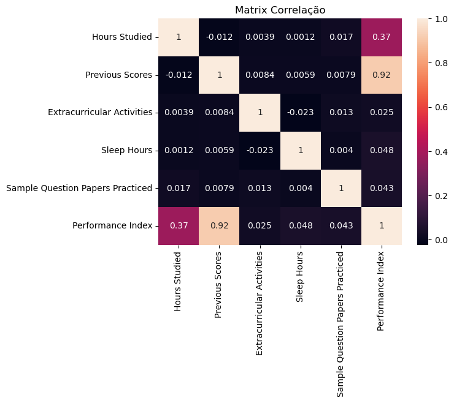

3. Ao visualizar os meus dados, observei uma clara relação linear entre 'Previous Score' e 'Performance Index', que pode até mesmo ser considerada forjada. Além disso, criei um gráfico de dispersão ('scatterplot') para 'Performance Index' e 'Hours Studied', identificando uma clara relação linear entre essas duas variáveis.

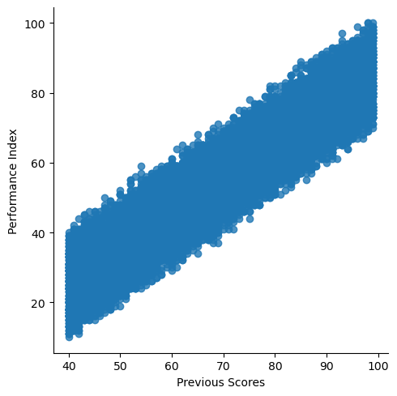 

4. Plotei um gráfico semelhante com 'Previous Score' e 'Performance Index', mas desta vez segmentando por 'Hours Studied'.

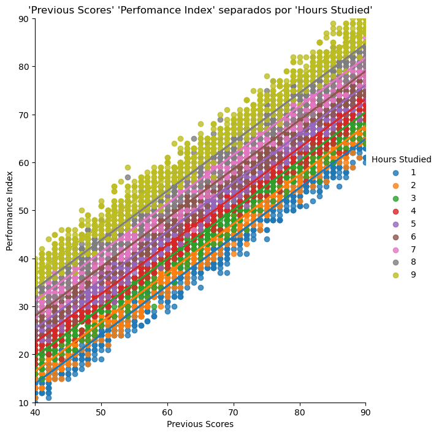

5.  **Parece possível identificar um padrão que sugere a possível utilização de apenas duas variáveis na criação do conjunto de dados.**"

$$
 f(x,y) = (a.x + b) + c.y
$$

- Sendo as variaveis
    - x =  'Previous Scores'             
    - y = 'Hours Studied'
    - f(x,y) = 'Performance Index'       

    - a, c = Coeficientes Angulares
    - b = intercept
### Machine Learning do dataset

Dado que o dataset parece ser bastante simples, optei por utilizar apenas duas variáveis na modelagem e previsão do 'Performance Index'. Além disso, há indícios de um comportamento fortemente linear, o que me levou a empregar o algoritmo de regressão linear na biblioteca do scikit-learn.

1. Inicialmente, dividi os dados em conjuntos de treinamento e teste, sendo o y = 'Performance Index' e o X = 'Previous Scores' e 'Hours Studied'

2. Em seguida, apliquei o modelo de regressão linear e ajustei os dados.
 
3. Criei um gráfico de dispersão comparando os valores previstos com os valores de teste, e notei uma discrepância mínima nos erros, o modelo parece prever bem os dados.

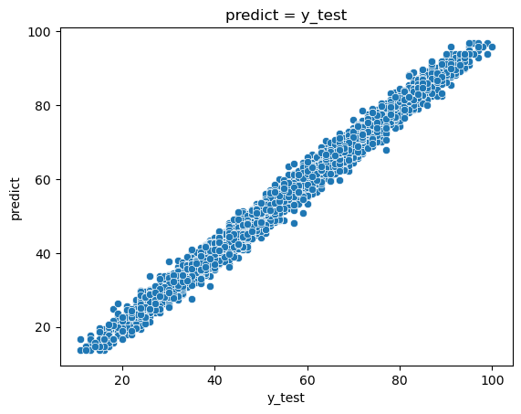

4. Para quantificar o erro, calculei o erro absoluto médio, que resultou em um valor de aproximadamente 1.8 para o 'Performance Index'. O erro parece ser baixo, e o modelo parece ter uma precisão significativa quando comparado à média dos valores do y_test, que é de 55, com um desvio padrão de 19.

Resultados para o y_test:
- Média = 19 
- σ = 19
- mean absolute error (MAE) = 18

Valores da regressão linear e função que descreve o modelo do dataset
- a = 1.0186
- b = -29.816
- c = 2.860

$$
 f(x,y) = (1.0186.x -29.816) + 2.860.y
$$

- Sendo as variaveis
    - x =  'Previous Scores'             
    - y = 'Hours Studied'
    - f(x,y) = 'Performance Index'       

5. Em seguida, criei o gráfico da regressão linear com o modelo

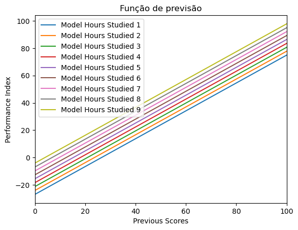

6. Plotei o gráfico do modelo e o do conjunto de dados juntos."

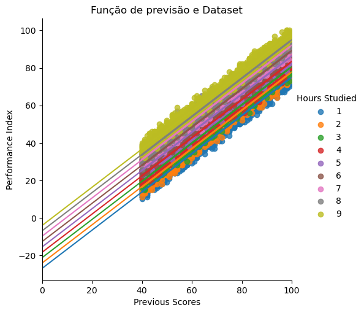

## Conclusão

Com a utilização de um modelo de regressão linear simples, que envolve apenas duas variáveis, "Previous Score" e "Hours Studied", conseguimos realizar uma modelagem eficaz do conjunto de dados do Kaggle. Isso resultou em um baixo erro, e o modelo gerado se assemelha significativamente ao modelo original do conjunto de dados.

# Power BI

# 2. Projeto Cardiovascular Diseases Risk Prediction Dataset

## 2. 0 Termos

**Confusion Matrix (Matriz de Confusão)**

A matriz de confusão é uma ferramenta amplamente utilizada para avaliar o desempenho de modelos de classificação. Ela é especialmente valiosa em cenários em que um modelo precisa distinguir entre apenas duas opções, como saudável e doente. A matriz de confusão nesses casos é representada por uma matriz 2x2.

Um modelo eficaz é aquele que apresenta proporções elevadas de verdadeiros positivos (TP) e verdadeiros negativos (TN), enquanto mantém as quantidades de falsos positivos (FP) e falsos negativos (FN) em níveis baixos. Isso é de particular importância quando lidamos com conjuntos de dados desbalanceados, nos quais uma das classes é muito menos frequente. Por exemplo, em um conjunto de dados em que a grande maioria (99%) dos casos é saudável, enquanto apenas 1% são doentes, a simples medição da acurácia não é suficiente.

A matriz de confusão é fundamental para avaliar o desempenho do modelo, pois permite a análise de métricas como precisão, recall e pontuação F1. Essas métricas fornecem insights mais abrangentes sobre o desempenho do modelo em relação às classes de interesse.

A matrix de confusão é divida em 4 terminologias:
A matriz de confusão é dividida em quatro terminologias:
"True" significa que o modelo fez uma previsão de acordo com o conjunto de dados.
"False" significa que o modelo fez uma previsão que não corresponde ao conjunto de dados.

    * True Positive (TP)": O valor é positivo, e o modelo previu corretamente como positivo.

    * True Negative (TN)": O valor é negativo, e o modelo previu corretamente como negativo.

    * False Positive (FP)": O valor é negativo, mas o modelo erroneamente previu como positivo (erro do tipo 1).

    * False Negative (FN)": O valor é positivo, mas o modelo erroneamente previu como negativo (erro do tipo 2).

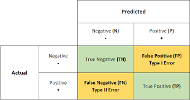

Exemplo

    * TP (Verdadeiro Positivo)": A pessoa tem a doença, e o modelo corretamente previu que ela a tem.
    * TN (Verdadeiro Negativo)": A pessoa não tem a doença, e o modelo corretamente previu que ela não a tem.
    * FP (Falso Positivo)": A pessoa está saudável, mas o modelo erroneamente previu que ela tem a doença (erro do tipo 1).
    * FN (Falso Negativo)": A pessoa tem a doença, mas o modelo erroneamente previu que ela está saudável (erro do tipo 2).

Termos:

**Accuracy**: É a porcentagem de vezes que o modelo acertou os resultados corretamente. No entanto, a acurácia pode não ser uma métrica confiável em conjuntos de dados desbalanceados, pois pode dar a impressão de alto desempenho quando o modelo está apenas prevendo a classe majoritária.

$$Accuracy = \frac{TP+TN}{TP+TN+FP+FN}$$

**Precision**: Refere-se à medida de quantas vezes o modelo indicou um determinado valor e acertou. Por exemplo, das vezes em que indicou que uma pessoa estava doente, quantas vezes estava correta.
$$Precison = \frac{TP}{TP+FP} $$

**Recall**: O recall é definido como a razão entre o número total de valores corretamente classificados como 1 (positivos verdadeiros) e o número total de valores que realmente são 1 (positivos verdadeiros e falsos negativos). Ele mede a capacidade do modelo de encontrar todos os casos positivos.

$$Recall = \frac{TP}{TP+FN}$$

**F1-score**: É a média harmônica da precisão e do recall. A média harmônica é usada porque é uma métrica que combina precisão e recall em uma única medida e é especialmente útil quando o desbalanceamento de classes é um problema, uma vez que não é tão sensível a grandes números.

$$F1score = 2(\frac{Recall*Precision}{Recall + Precision}) $$

**ROC - AUC** é uma medida de desempenho usada em problemas de classificação em diferentes configurações de limiar. A curva ROC é uma representação gráfica de probabilidade e o AUC (Área Sob a Curva) representa o grau ou medida de separabilidade. Isso indica quão bem o modelo é capaz de distinguir entre as classes. Quanto maior o valor do AUC, melhor o desempenho do modelo em prever as classes 0 como 0 e as classes 1 como 1. Por analogia, um AUC mais alto indica que o modelo é melhor em distinguir entre pacientes com a doença e sem a doença.

## 2.1 Introdução
Neste projeto, o objetivo era realizar a análise de dados de pessoas e prever o risco de doenças cardiovasculares, utilizando técnicas de Machine Learning, e entender como as variáveis se relacionavam entre si. Inicialmente, realizamos a visualização e análise dos dados utilizando Python. Posteriormente, também conduzimos uma análise e visualização utilizando a ferramenta Power BI, com o propósito de estudar e demonstrar minhas habilidades em sua utilização.

O conjunto de dados pode ser encontrado [Kaggle](https://www.kaggle.com/datasets/alphiree/cardiovascular-diseases-risk-prediction-dataset) e no meu github na pasta com o código em Python.

### 2.1.1 Sobre o Dataset
O conjunto de dados 'Cardiovascular Diseases Risk Prediction Dataset' é composto por 308854 linhas e 18 colunas. Cada linha representa uma pessoa e cada coluna representa uma variável.

Variáveis  e seus tipos: 
- General_Health - Categórico ordinal
- Checkup - Categórico ordinal
- Exercise - Binária
- Heart_Disease - Binária
- Skin_Cancer - Binária
- Other_Cancer - Binária
- Depression - Binária
- Diabetes - Categórico ordinal
- Arthritis - Binária
- Sex - Binária
- Age_Category - Categórico ordinal
- Height_(cm) - Numérica 
- Weight_(kg) - Numérica 
- BMI - Numerica 
- Smoking_History - Binária
- Alcohol_Consumption - Numérica 
- Fruit_Consumption - Numérica 
- Green_Vegetables_Consumption - Numérica 	
- FriedPotato_Consumption - Numérica 

## 2.2 Explicando o Código de Visualização
1. Verifiquei a presença de valores nulos no código e constatei que não havia nenhum.

2. Realizei a conversão dos dados que eram não numéricos, incluindo variáveis binárias e categóricas ordinais, para formatos numéricos, a fim de torná-los compatíveis com os algoritmos em Python.

- As variáveis binárias foram codificadas como 0 e 1.
- No caso das variáveis categóricas ordinais, realizei a ordenação numérica. Por exemplo, na variável 'General_Health', substituí os valores 'Poor' por 0, 'Fair' por 1, 'Good' por 2, 'Very Good' por 3 e 'Excellent' por 4. 

    Isso permitiu que os algoritmos de análise e modelagem de dados pudessem operar com compatibilidade e de maneira apropriada.

3. Fiz e plotei uma matrix de correção com os valores absolutos para saber quais eram as variaveis com maiores correlação com a 'Heart_Disease'

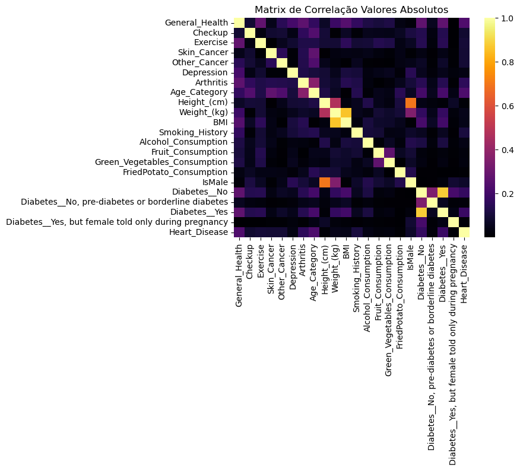

Valores de Correlação das Variáveis com a Variável 'Heart_Disease'

- Heart_Disease                                           1.000000
- Age_Category                                            0.229011
- Diabetes__Yes                                           0.181072
- Arthritis                                               0.153913
- Smoking_History                                         0.107797
- Other_Cancer                                            0.092387
- Skin_Cancer                                             0.090848
- IsMale                                                  0.072595
- Weight_(kg)                                             0.045875
- BMI                                                     0.042666
- Depression                                              0.032526
- Diabetes__No, pre-diabetes or borderline diabetes       0.019008
- Height_(cm)                                             0.015780
- FriedPotato_Consumption                                -0.009227
- Diabetes__Yes, but female told only during pregnancy   -0.015198
- Fruit_Consumption                                      -0.020055
- Green_Vegetables_Consumption                           -0.024043
- Alcohol_Consumption                                    -0.036569
- Checkup                                                -0.085596
- Exercise                                               -0.096347
- Diabetes__No                                           -0.169569
- General_Health                                         -0.232503

Valores de Correlação das Variáveis com a Variável 'Heart_Disease' Valores Absolutos

- Heart_Disease                                           1.000000
- General_Health                                          0.232503
- Age_Category                                            0.229011
- Diabetes__Yes                                           0.181072
- Diabetes__No                                            0.169569
- Arthritis                                               0.153913
- Smoking_History                                         0.107797
- Exercise                                                0.096347
- Other_Cancer                                            0.092387
- Skin_Cancer                                             0.090848
- Checkup                                                 0.085596
- IsMale                                                  0.072595
- Weight_(kg)                                             0.045875
- BMI                                                     0.042666
- Alcohol_Consumption                                     0.036569
- Depression                                              0.032526
- Green_Vegetables_Consumption                            0.024043
- Fruit_Consumption                                       0.020055
- Diabetes__No, pre-diabetes or borderline diabetes       0.019008
- Height_(cm)                                             0.015780
- Diabetes__Yes, but female told only during pregnancy    0.015198
- FriedPotato_Consumption                                 0.009227

5. Notamos que os valores com maior correlação com 'Heart Disease' seriam 'General_Health', 'Age_Category', 'Diabetes__Yes', 'Diabetes__no', Arthritis', 'Smoking_History', 'Exercise'.

Através da análise de correlação, podemos supor que há uma menor probabilidade de problemas cardíacos em pessoas mais jovens, praticantes de exercícios, sem problemas de saúde significativos e que não têm diabetes.

## 2.3 Visualização 

Neste tópico, conduziremos a visualização das variáveis mais relevantes relacionadas à presença de doenças cardíacas (Heart_Disease) e sua interação, com o objetivo de aprofundar a compreensão do comportamento do conjunto de dados. Após cada gráfico, forneceremos uma breve descrição da visualizaçã

1. Boxplot 'Heart Disease' e 'General Health', é possível observar a menor média de incidência de doenças do coração  em pessoas com boa 'General Health'

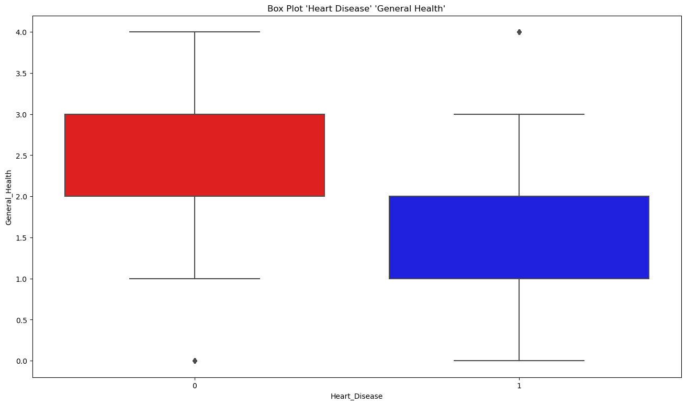

2. É possível observar que indivíduos diagnosticados com 'Heart_Disease' tendem a realizar check-ups com maior frequência, possivelmente em virtude da detecção da doença, o que os motiva a buscar acompanhamento médico regular.

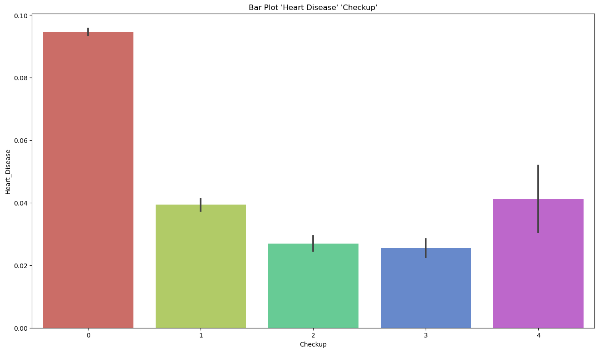

3. A mesma expliacação do gráfico anterior  É possível observar que indivíduos diagnosticados com 'Heart_Disease' tendem a realizar check-ups com maior frequência, possivelmente em virtude da detecção da doença, o que os motiva a buscar acompanhamento médico regular.

4. Bar Plot das variaveis 'Heart_Disease' e 'Exercise', é perceptível uma frequência significativamente menor de pessoas que praticam exercícios físicos e a ocorrência de doenças cardíacas.
 

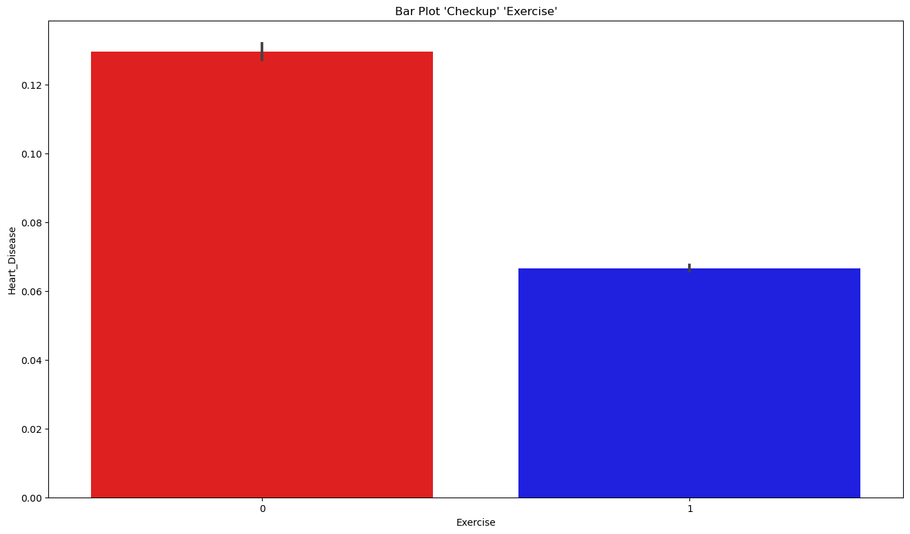

5 .Em um gráfico de barras que compara as variáveis 'Heart_Disease' e 'Skin_Cancer', é evidente que a presença de câncer de pele está associada a um aumento na ocorrência de doenças cardíacas.

 

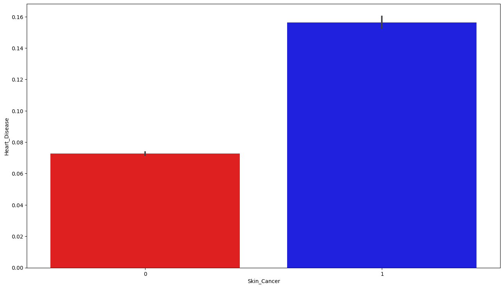

6.Em um gráfico de barras que compara as variáveis 'Heart_Disease' e 'Other_Cancer', é evidente que a presença de câncer está associada a um aumento na ocorrência de doenças cardíacas.

 

7.Em um gráfico de barras que compara as variáveis 'Heart_Disease' e 'Depression', Depressão está levemente associada a um aumento na ocorrência de doenças cardíacas.
 

8. Em um gráfico de barras que compara as variáveis 'Heart_Disease' e 'Arthritis', é notável uma forte associação entre a presença de artrite e um aumento na incidência de doenças cardíacas. 
 

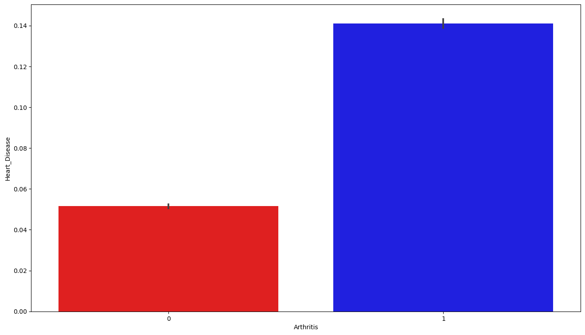

9. Um gráfico de barras que compara as variáveis 'Heart_Disease' e 'Age_Category' revela uma clara dependência, onde o aumento da idade está fortemente relacionado com um aumento na incidência de doenças cardíacas, , à medida que a idade avança, a probabilidade de ocorrência de doenças cardíacas aumenta significativamente. 

 

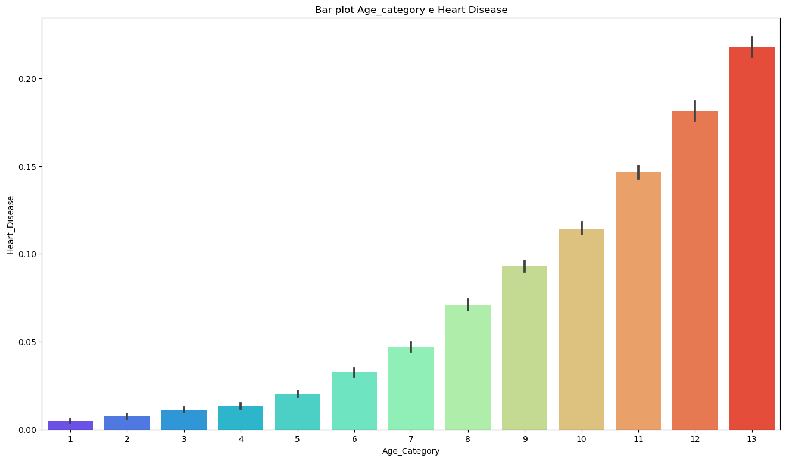

10.Um gráfico de barras que compara as variáveis 'Heart_Disease' e 'Age_Category', segmentado de acordo com a várivavel 'Exercise', sugere que a prática de exercícios pode estar associada ao atraso na manifestação de doenças cardíacas.

 

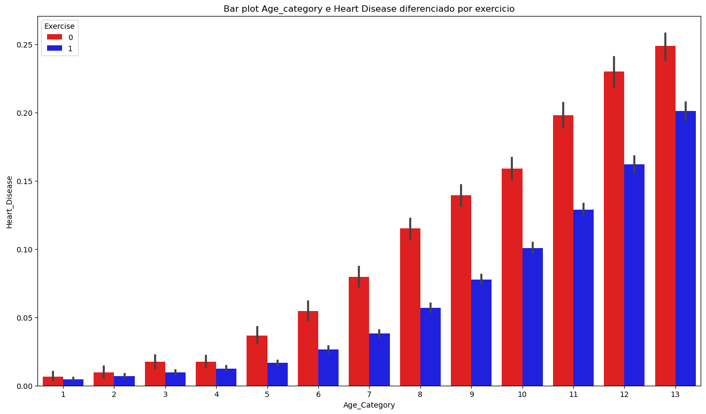

11. Não se ve uma relação expressiva entre 'Heart Disease' e 'Height', não parece ter correlação expressiva entre altura e doenças no coração.
 

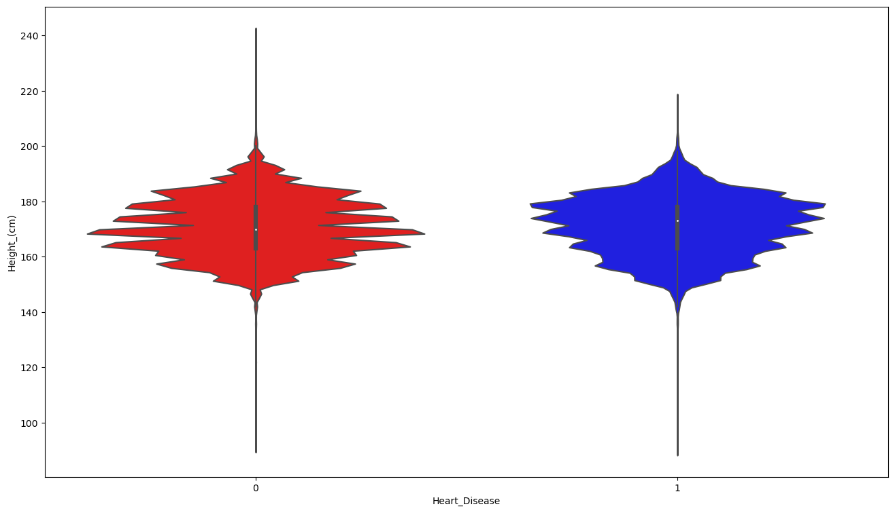

12. Não se ve uma relação expressiva entre 'Heart Disease' e 'Weight', não parece ter correlação expressiva entre peso e doenças no coração, porém a média é 3 kg maior para pessoas com doenças de coração

 

13. Não se ve uma relação expressiva entre 'Heart Disease' e 'BMI', não parece ter correlação expressiva entre peso e doenças no coração, porém a média é 1 ponto maior para pessoas com doenças de coração.

 

14. O gráfico de barras (barplot) das variáveis 'Heart_Disease' e 'Smoking_History' revela uma notável associação entre o histórico de tabagismo e doenças cardíacas. Observa-se uma probabilidade aproximadamente duas vezes maior de uma pessoa com histórico de fumante ter doença cardíaca em comparação a alguém que nunca fumou.

 

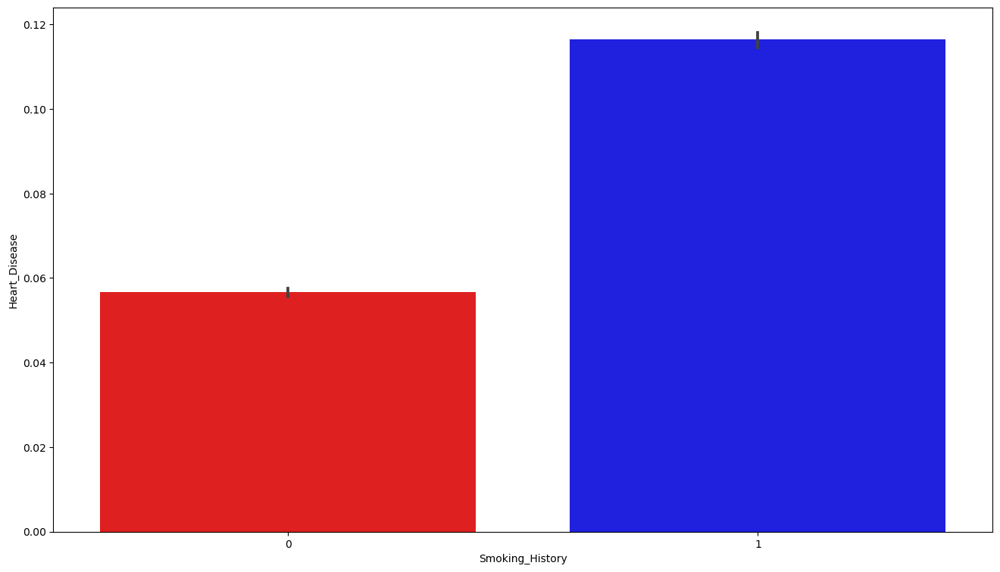

15. Ao analisar o violinplot do consumo de álcool em relação a doenças cardíacas, nota-se uma semelhança no padrão de consumo em ambos os grupos.

 

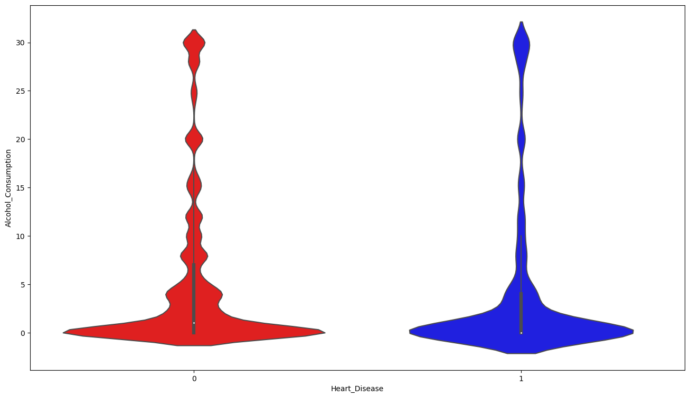

16. Ao examinar o boxplot do consumo de frutas em relação a doenças cardíacas, observamos uma semelhança notável nos padrões de consumo em ambos os grupos. Parece haver uma tendência indicando que pessoas que consomem mais frutas têm uma probabilidade menor de desenvolver doenças cardíacas. No entanto, é importante notar que, com base nos dados deste conjunto, não podemos fazer afirmações definitivas sobre essa relação.

 

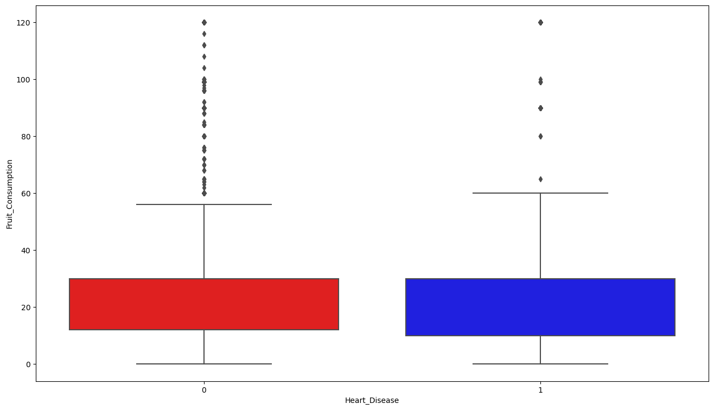

17. O boxplot do consumo de vegetais em relação às doenças cardíacas, percebe-se uma semelhança notável nos padrões de consumo em ambos os grupos. Parece que o consumo de vegetais é semelhante em pessoas com e sem doenças cardíacas, sugerindo que não há uma diferença significativa com base nesses dados
 

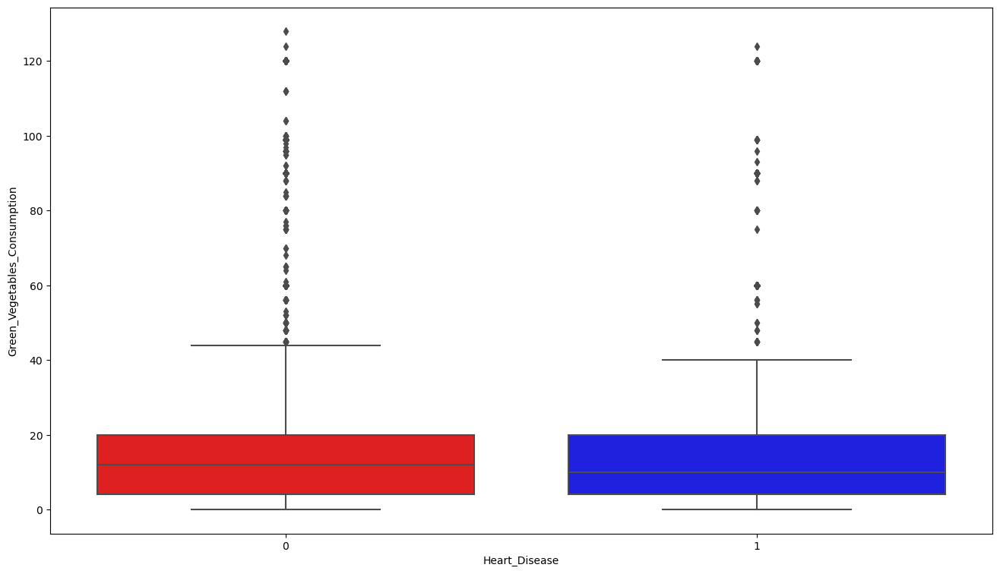

18. No o boxplot do consumo de batata frita em relação às doenças cardíacas, observamos uma semelhança notável nos padrões de consumo em ambos os grupos. Parece que o consumo de batata frita é semelhante em pessoas com e sem doenças cardíacas, sugerindo que não há uma relação evidente com base nesses dados.
 

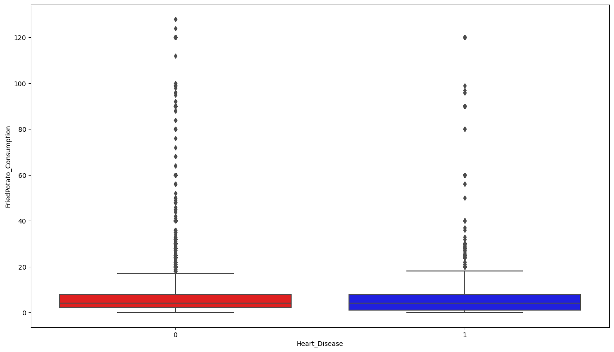

19. Gráfico de barras (barplot) que representa a ocorrência de doenças cardíacas, separadas por sexo, sugere uma forte correlação entre o gênero masculino e a presença de problemas cardíacos. Parece haver uma associação notável entre ser do sexo masculino e ter doenças cardíacas com base nos dados apresentados.
 

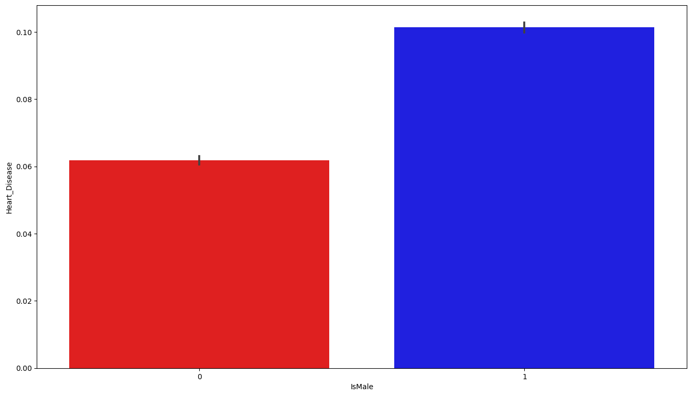

20. Gráfico de barras (barplot) que representa a relação entre a categoria de idade ('Age_Category') e a presença de doenças cardíacas ('Heart_disease') revela uma tendência marcante. A frequência de doenças cardíacas em homens é significativamente maior em todas as faixas etárias, tornando-se ainda mais pronunciada à medida que a idade avança.

 

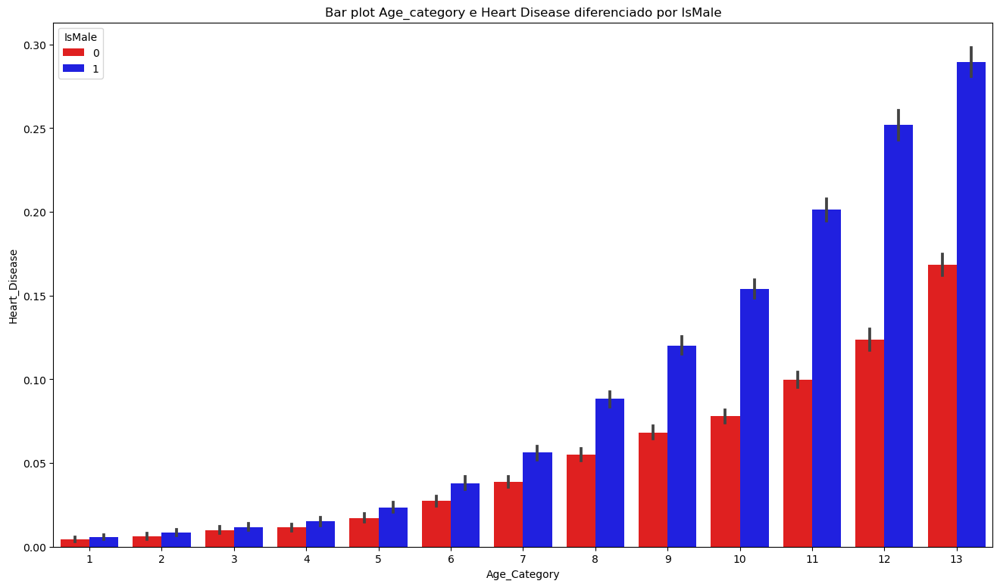

21. Barplot de 'Age_category' e 'Heart Disease' separado por 'Smoking_history'.  A frequencia de doenças cardiacas em pessoas fumantes é maior em todas as idades, e se torna maior a medida que fica mais velho
 
 

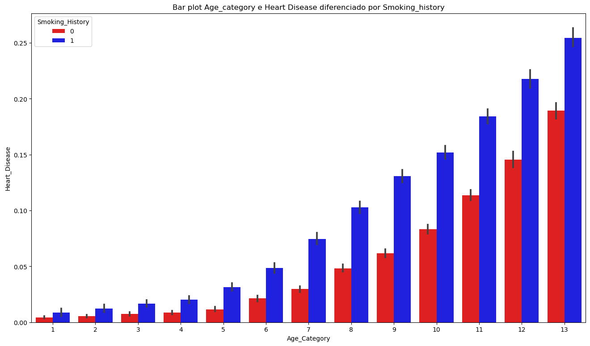

 22. Barplot de 'Age_category' e 'Heart Disease' separado por 'Diabetes'.  A frequencia de doenças cardiacas em pessoas com diabetes é maior em todas as idades, e se torna maior a medida que fica mais velho. Diabetes aparenta ser o dado com maior associação com a incidência de problemas cardiacos
 

 

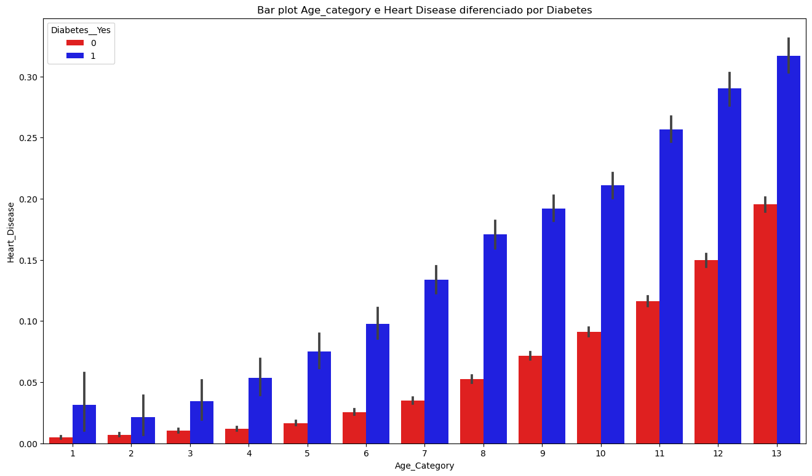

23. Gráfico de barras ('Barplot') para 'Age_category' e 'Heart Disease', segregado por 'Arthritis'. Observa-se que a prevalência de doenças cardíacas em indivíduos com artrite é maior em todas as faixas etárias e aumenta à medida que envelhecem."

 

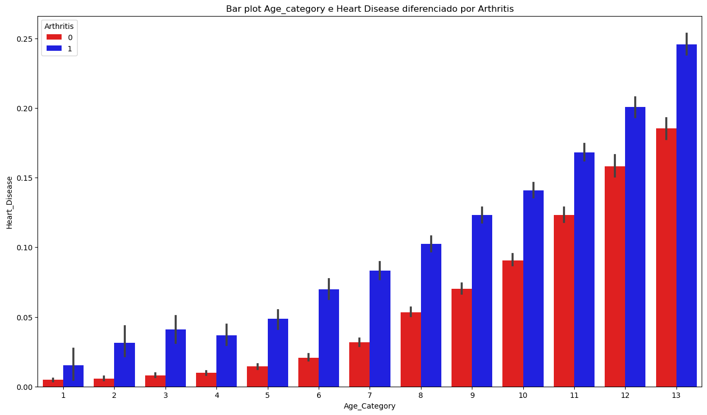

23. Gráfico de barras ('Barplot') para 'Age_category' e 'Heart Disease', segregado por 'Depression'. Observa-se que a prevalência de doenças cardíacas em indivíduos com depressão é maior em todas as faixas etárias e aumenta à medida que envelhecem."

 

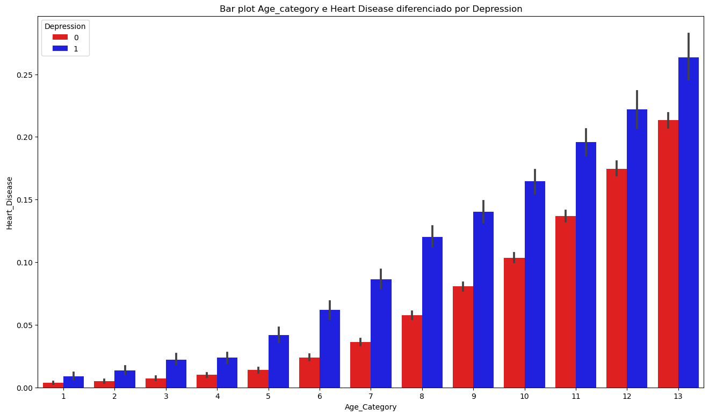

23. No gráfico de barras de 'Heart Disease' separado por 'Diabetes', observa-se que a frequência de pessoas com 'Heart Disease' é aproximadamente 3,3 vezes maior em indivíduos que também têm diabetes.

 

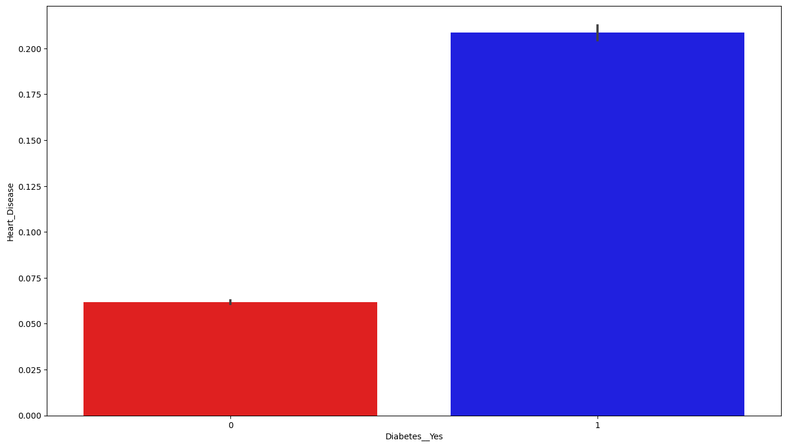

23. Gráfico de barras de 'Age_category' e 'Diabetes', segmentado por 'Heart Disease'. A frequência de doenças cardíacas em pessoas com diabetes é maior em todas as faixas etárias.

 

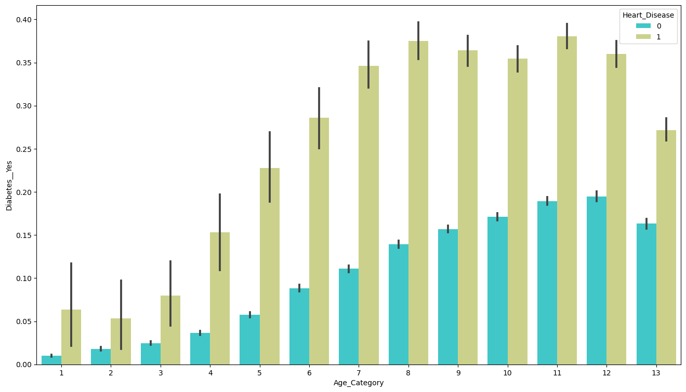

## 2.5 Machine Learning do dataset
Utilizei o algoritmo XGBoostClassifier, o CatBoostClassifier e o Random Forest para construir o modelo de aprendizado de máquina.
para saber quais deles seria o mais eficiente para o meu dataset

1. Primeiramente, os dados foram balanceados, uma vez que o número de pessoas saudáveis era significativamente maior do que o número de pessoas com 'Heart_Disease' (com uma razão de 11.36 entre saudáveis e doentes). A técnica de undersampling foi utilizada para reduzir o número de dados, em oposição à técnica de oversampling, que estava causando overfitting.
2. Os dados foram divididos em conjuntos de treinamento e teste.

3. Em seguida, uma nova separação dos dados foi feita para avaliar seu comportamento quando estavam balanceados. Os algoritmos XGBoostClassifier, CatBoostClassifier e Random Forest foram treinados com esses dados.

4. A análise incluiu a avaliação da precisão, o relatório de classificação e a área da curva ROC dos três conjuntos de dados. Todos apresentaram resultados muito semelhantes.

5. Posteriormente, foram feitas previsões em um conjunto de dados desbalanceado.

6. Foram conduzidos testes de redução de dimensionalidade, eliminando as features menos importantes, a fim de avaliar o impacto dessa ação na melhoria do desempenho do modelo.

7. Foi implementada uma abordagem de ensemble, combinando modelos por meio das técnicas de hard voting, bem como aplicando a técnica de soft voting.

Nos dados balanceados, uma maior precisão no modelo foi alcançada. No entanto, quando o modelo foi utilizado para prever no conjunto de dados desbalanceado (original), a precisão diminuiu. Os três modelos apresentaram resultados muito semelhantes, sem que um se destacasse claramente em relação aos outros.

## 2.5.1 Resultados 
#### Dados com Undersampling
Os resultados dos três algoritmos foram notavelmente semelhantes, como será evidenciado adiante. Na primeira etapa, utilizamos dados balanceados, empregando o método de undersampling.

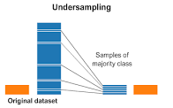

##### XGBoostClassifier

             XGBC

                    precision    recall  f1-score   support

             0       0.78      0.72      0.75      2240
             1       0.74      0.80      0.77      2262

             accuracy                          0.76      4502
             macro avg     0.76      0.76      0.76      4502
             weighted avg  0.76      0.76      0.76      4502

             [[1604  636]
             [ 445 1817]]

 

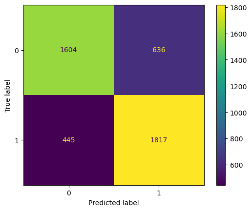

 

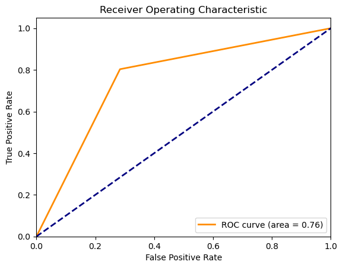

##### CatBoostClassifier

             CATBOOST

             precision    recall  f1-score   support

             0   0.79      0.72      0.75      2240
             1   0.74      0.81      0.78      2262

             accuracy                          0.76      4502
             macro avg     0.77      0.76      0.76      4502
             weighted avg  0.77      0.76      0.76      4502

             [[1609  631]
             [ 427 1835]]

 

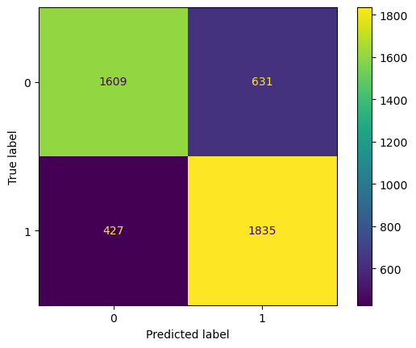

 

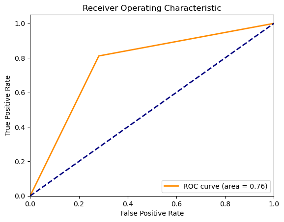

##### RandomForest

             RandomForest

             precision    recall  f1-score   support

             0       0.77      0.71      0.74      2240
             1       0.73      0.79      0.76      2262

             accuracy                            0.75      4502
             macro avg       0.75      0.75      0.75      4502
             weighted avg    0.75      0.75      0.75      4502

             [[1585  655]
             [ 470 1792]]

 
3

 

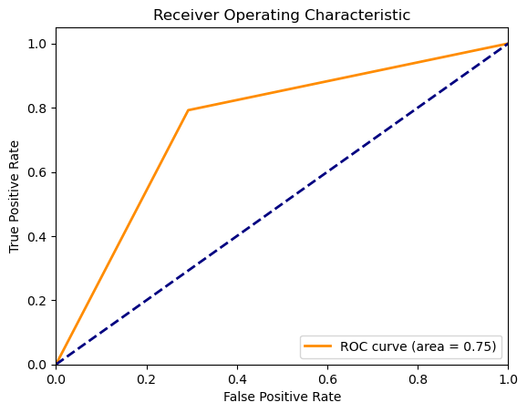

#### Dados normais (sem Undersampling e desbalanceados)

##### XGboostClassifier
	
             XGboostClassifier
             Accuracy: 0.7184484879880852

             precision    recall  f1-score   support

             0       0.98      0.71      0.82     28421
             1       0.19      0.81      0.31      2465

             accuracy                          0.72     30886
             macro avg     0.59      0.76      0.57     30886
             weighted avg  0.91      0.72      0.78     30886

             [[20205  8216]
             [  480  1985]]

##### Catboost
             Catboost
             Accuracy: 0.7229165317619634

              precision    recall  f1-score   support

             0       0.98      0.72      0.83     28421
             1       0.20      0.81      0.32      2465

             accuracy                            0.72     30886
             macro avg       0.59      0.76      0.57     30886
             weighted avg    0.92      0.72      0.79     30886

             [[20327  8094]
             [  464  2001]]

##### RandomForest
             RandomForest
             Accuracy: 0.7210710354205789
             precision    recall  f1-score   support

             0       0.98      0.71      0.83     28421
             1       0.19      0.79      0.31      2465

             accuracy                           0.72     30886
             macro avg       0.58      0.75      0.57     30886
             weighted avg       0.91      0.72      0.78     30886

             [[20318  8103]
             [  512  1953]]

## 2.5.2 Diminuição de Dimensionalidade por Importancia de Features

Ao avaliar a importância das features em cada modelo, destaca-se que Age_category, General_health, BMI e Weight desempenham papéis significativos, enquanto termos como 'diabetes apenas na gravidez' não são muito  utilizados em nenhum dos modelos."

 

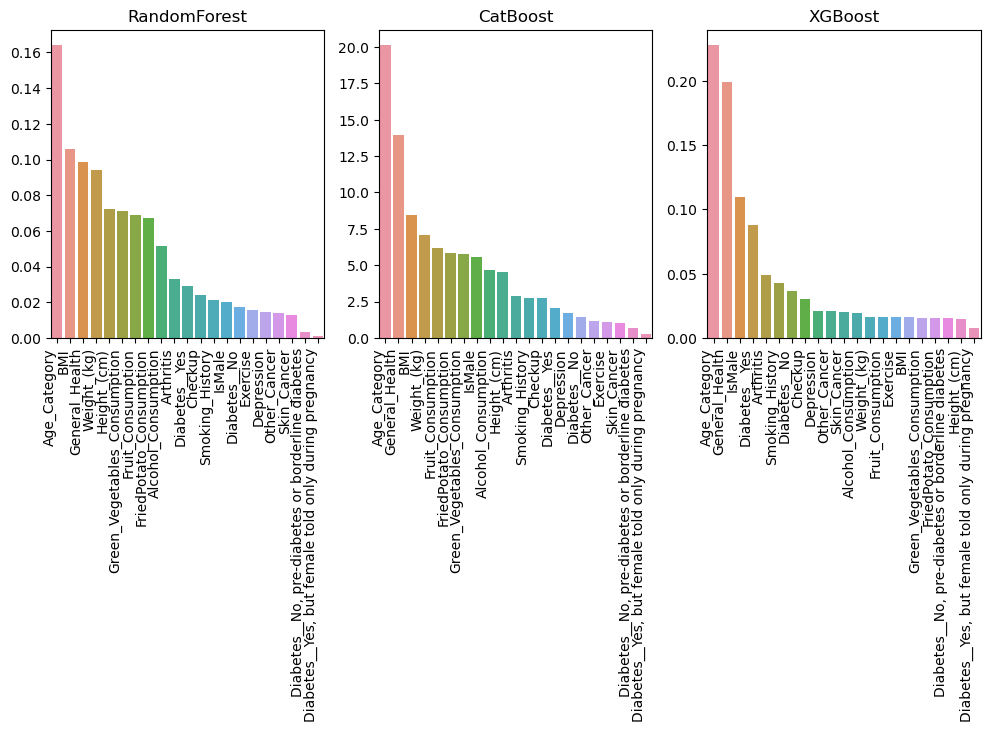

Foram construídos modelos com menos dimensões, eliminando as variáveis menos importantes em cada caso.

deu melhor desempenho quando retirada **n**:

**Random Forest**: n = 2 ;

**CATBOOST** n = 4;

**XGBOOST** n = 3.

**Importante notar que, em todos os modelos, as melhorias são bem pequenas.**

 

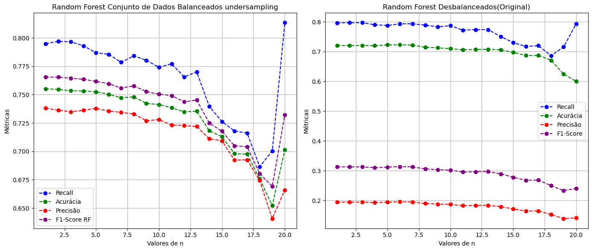

 

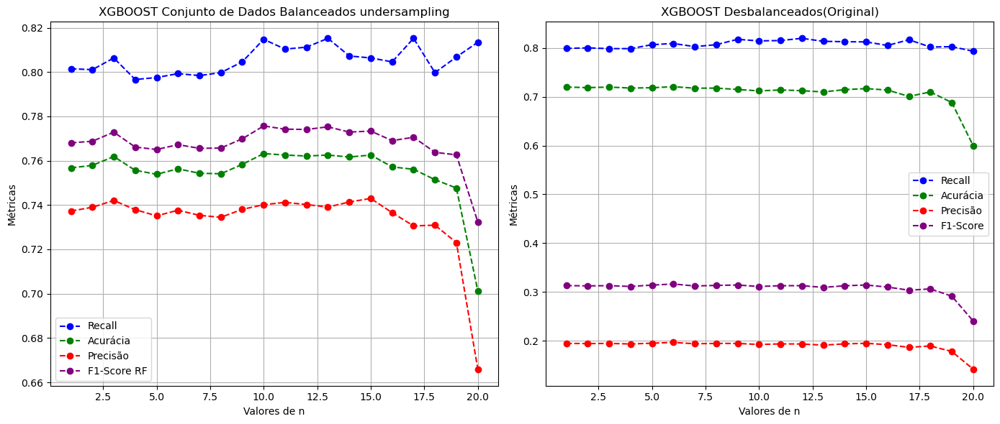

 

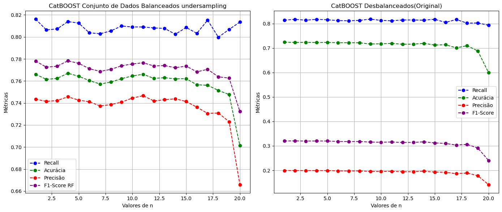

### 2.5.3 Hard Voting e Soft Voting
Foram utilizadas as técnicas de hard voting e soft voting com o objetivo de combinar os modelos e melhorar o desempenho. O melhor desempenho foi alcançado com o hard voting, onde n = 4, porém, os resultados são bastante semelhantes em ambos os modelos quando se trata de dados desbalanceados.
 

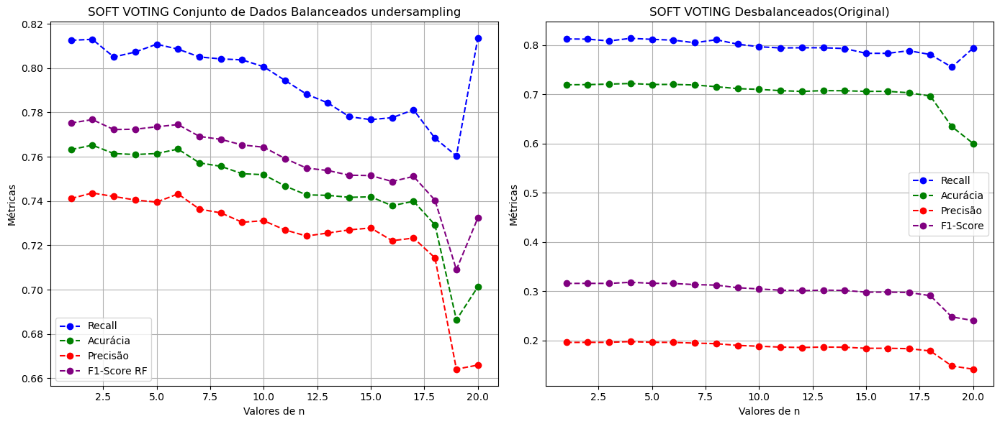

 

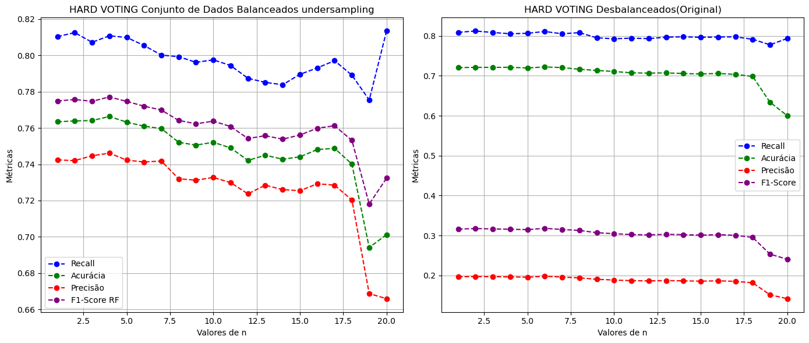

## 2.6 Conclusão a partir da visualização dos dados:
Ao analisar o conjunto de dados, observamos uma clara associação entre diversas variáveis e a ocorrência de doença cardíaca ('Heart_Disease'). As variáveis que mais se destacaram foram 'Diabetes', 'IsMale' e 'Age_Category'. Além disso, notou-se uma associação mais evidente com 'Heart_Disease' ao considerar variáveis como 'Smoking_History', 'Other_Cancer', 'Skin_Cancer', 'Depression', 'Checkup', 'General_Health' e 'Exercise' em conjunto com 'Age_Category'. Isso nos permitiu compreender o impacto de hábitos saudáveis, como a prática de exercícios, e como as doenças afetam a saúde das pessoas ao longo dos anos.

No entanto, não foi possível identificar associações significativas com variáveis como peso, altura, índice de massa corporal (IMC), consumo de álcool, consumo de frutas, consumo de vegetais e consumo de batatas fritas."

## 2.7 Conclusão Machine Learning

Todos os modelos testados apresentaram resultados bastante semelhantes quando aplicados tanto a conjuntos de dados balanceados quanto ao conjunto de dados original. Uma das técnicas que podem ser utilizadas para a melhoria do modelo é a busca por melhores parâmetros nos modelos treinados, o que poderia resultar na identificação de um algoritmo com desempenho superior na previsão de 'Heart_Disease'.

Aplicação de técnicas de engenharia de features pode potencialmente aprimorar o desempenho do modelo. Da mesma forma, considerar a utilização de modelos mais complexos pode ser uma estratégia eficaz para otimizar o desempenho do modelo.

