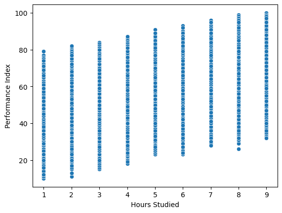

### Projeto Student_Perfomance Kaggle

## Introdução

Neste projeto, o objetivo era realizar a análise de dados das estudantes e como as variáveis se comportavam entre si. Inicialmente, foi feita a visualização e análise utilizando Python. Posteriormente, também foi realizada uma análise e visualização utilizando a ferramenta Power BI, com o propósito de estudo e demonstração das minhas habilidades na sua utilização.
O Dataset se encontra no kaggle no site [Kaggle](https://www.kaggle.com/datasets/nikhil7280/student-performance-multiple-linear-regression) e no meu Github.

## Sobre o dataset o Dataset e Analise

O Dataset desse estudo consiste de 10000 linhas e 6 colunas, sendo cada linha 1 estudante diferente e as colunas indicando as 6 váriaveis sendo elas: 
- Variaveis e seus tipos
    - Hours Studied - Inteiro                
    - Previous Scores - Inteiro             
    - Extracurricular Activities - Binária (Sim ou Não)          
    - Sleep Hours - Inteiro                      
    - Sample Question Papers Practiced - Inteiro    
    - Performance Index - Float             

## Explicando o código e Visualização
1.  Primeiramente, no código Python, realizei a verificação de valores nulos no conjunto de dados. Em seguida, converti a variável 'Extracurricular Activities' para um formato numérico, a fim de facilitar sua manipulação.

2. Elaborei uma matriz de correlação para identificar quais variáveis estão principalmente relacionadas linearmente com a variável que desejo analisar, o 'Performance Index'. As variáveis 'Hours Studied' e 'Previous Score' apresentaram as maiores correlações

3. Ao visualizar os meus dados, observei uma clara relação linear entre 'Previous Score' e 'Performance Index', que pode até mesmo ser considerada forjada. Além disso, criei um gráfico de dispersão ('scatterplot') para 'Performance Index' e 'Hours Studied', identificando uma clara relação linear entre essas duas variáveis.

 

4. Plotei um gráfico semelhante com 'Previous Score' e 'Performance Index', mas desta vez segmentando por 'Hours Studied'.

5.  **Parece possível identificar um padrão que sugere a possível utilização de apenas duas variáveis na criação do conjunto de dados.**"

$$
 f(x,y) = (a.x + b) + c.y
$$

- Sendo as variaveis
    - x =  'Previous Scores'             
    - y = 'Hours Studied'
    - f(x,y) = 'Performance Index'       

    - a, c = Coeficientes Angulares
    - b = intercept
### Machine Learning do dataset

Dado que o dataset parece ser bastante simples, optei por utilizar apenas duas variáveis na modelagem e previsão do 'Performance Index'. Além disso, há indícios de um comportamento fortemente linear, o que me levou a empregar o algoritmo de regressão linear na biblioteca do scikit-learn.

1. Inicialmente, dividi os dados em conjuntos de treinamento e teste, sendo o y = 'Performance Index' e o X = 'Previous Scores' e 'Hours Studied'

2. Em seguida, apliquei o modelo de regressão linear e ajustei os dados.
 
3. Criei um gráfico de dispersão comparando os valores previstos com os valores de teste, e notei uma discrepância mínima nos erros, o modelo parece prever bem os dados.

4. Para quantificar o erro, calculei o erro absoluto médio, que resultou em um valor de aproximadamente 1.8 para o 'Performance Index'. O erro parece ser baixo, e o modelo parece ter uma precisão significativa quando comparado à média dos valores do y_test, que é de 55, com um desvio padrão de 19.

Resultados para o y_test:
- Média = 19 
- σ = 19
- mean absolute error (MAE) = 18

Valores da regressão linear e função que descreve o modelo do dataset
- a = 1.0186
- b = -29.816
- c = 2.860

$$
 f(x,y) = (1.0186.x -29.816) + 2.860.y
$$

- Sendo as variaveis
    - x =  'Previous Scores'             
    - y = 'Hours Studied'
    - f(x,y) = 'Performance Index'       

5. Em seguida, criei o gráfico da regressão linear com o modelo

6. Plotei o gráfico do modelo e o do conjunto de dados juntos."

## Conclusão

Com a utilização de um modelo de regressão linear simples, que envolve apenas duas variáveis, "Previous Score" e "Hours Studied", conseguimos realizar uma modelagem eficaz do conjunto de dados do Kaggle. Isso resultou em um baixo erro, e o modelo gerado se assemelha significativamente ao modelo original do conjunto de dados.

# Power BI

