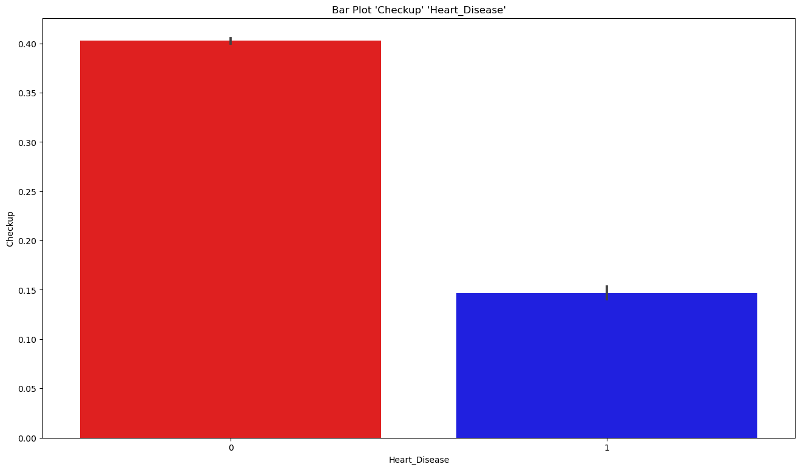
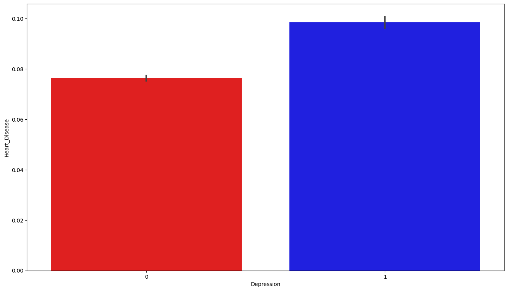
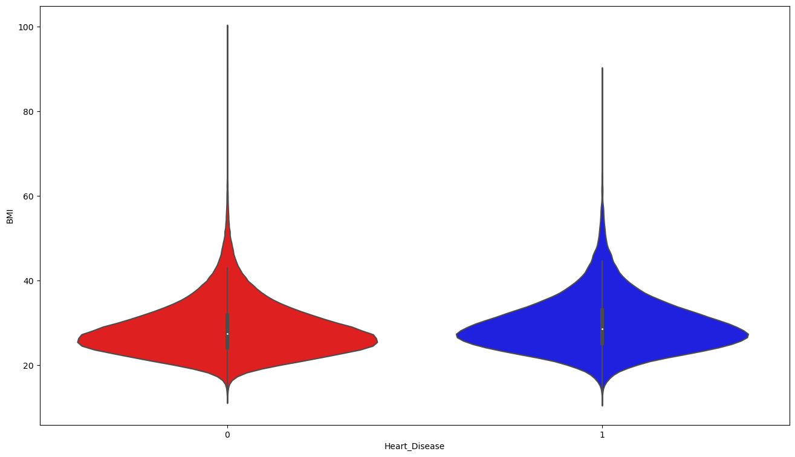
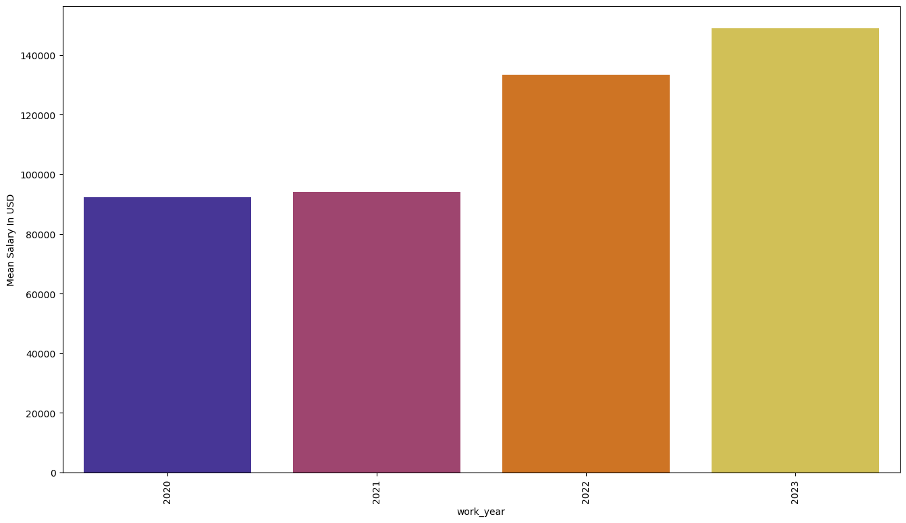
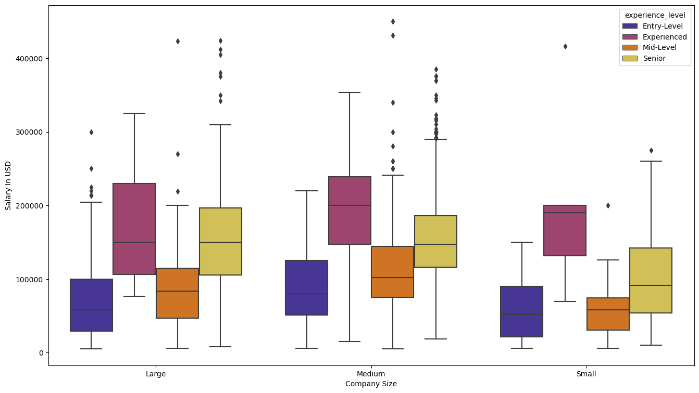
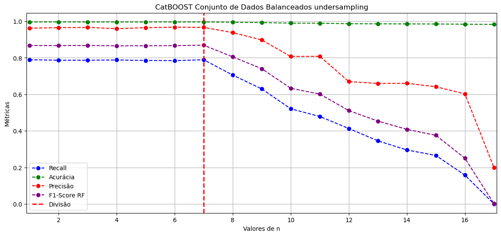

# 1.Projeto Student_Perfomance Kaggle

## 1.1 Introdução

Neste projeto, o objetivo era realizar a análise de dados das estudantes e como as variáveis se comportavam entre si. Inicialmente, foi feita a visualização e análise utilizando Python. Posteriormente, também foi realizada uma análise e visualização utilizando a ferramenta Power BI, com o propósito de estudo e demonstração das minhas habilidades na sua utilização.
O Dataset se encontra no kaggle no site [Kaggle](https://www.kaggle.com/datasets/nikhil7280/student-performance-multiple-linear-regression) e no meu Github.

### 1.1.1 Sobre o Dataset

O Dataset desse estudo consiste de 10000 linhas e 6 colunas, sendo cada linha 1 estudante diferente e as colunas indicando as 6 váriaveis sendo elas: 
- Variaveis e seus tipos
    - Hours Studied - Inteiro                
    - Previous Scores - Inteiro             
    - Extracurricular Activities - Binária (Sim ou Não)          
    - Sleep Hours - Inteiro                      
    - Sample Question Papers Practiced - Inteiro    
    - Performance Index - Float             

## 1.2 Explicando o código e Visualização
1.  Primeiramente, no código Python, realizei a verificação de valores nulos no conjunto de dados. Em seguida, converti a variável 'Extracurricular Activities' para um formato numérico, a fim de facilitar sua manipulação.

2. Elaborei uma matriz de correlação para identificar quais variáveis estão principalmente relacionadas linearmente com a variável que desejo analisar, o 'Performance Index'. As variáveis 'Hours Studied' e 'Previous Score' apresentaram as maiores correlações

3. Ao visualizar os meus dados, observei uma clara relação linear entre 'Previous Score' e 'Performance Index', que pode até mesmo ser considerada forjada. Além disso, criei um gráfico de dispersão ('scatterplot') para 'Performance Index' e 'Hours Studied', identificando uma clara relação linear entre essas duas variáveis.

 

4. Plotei um gráfico semelhante com 'Previous Score' e 'Performance Index', mas desta vez segmentando por 'Hours Studied'.

5.  **Parece possível identificar um padrão que sugere a possível utilização de apenas duas variáveis na criação do conjunto de dados.**"

$$
 f(x,y) = (a.x + b) + c.y
$$

- Sendo as variaveis
    - x =  'Previous Scores'             
    - y = 'Hours Studied'
    - f(x,y) = 'Performance Index'       

    - a, c = Coeficientes Angulares
    - b = intercept
## 1.3 Machine Learning do dataset

Dado que o dataset parece ser bastante simples, optei por utilizar apenas duas variáveis na modelagem e previsão do 'Performance Index'. Além disso, há indícios de um comportamento fortemente linear, o que me levou a empregar o algoritmo de regressão linear na biblioteca do scikit-learn.

1. Inicialmente, dividi os dados em conjuntos de treinamento e teste, sendo o y = 'Performance Index' e o X = 'Previous Scores' e 'Hours Studied'

2. Em seguida, apliquei o modelo de regressão linear e ajustei os dados.
 
3. Criei um gráfico de dispersão comparando os valores previstos com os valores de teste, e notei uma discrepância mínima nos erros, o modelo parece prever bem os dados.

4. Para quantificar o erro, calculei o erro absoluto médio, que resultou em um valor de aproximadamente 1.8 para o 'Performance Index'. O erro parece ser baixo, e o modelo parece ter uma precisão significativa quando comparado à média dos valores do y_test, que é de 55, com um desvio padrão de 19.

Resultados para o y_test:
- Média = 19 
- σ = 19
- mean absolute error (MAE) = 18

Valores da regressão linear e função que descreve o modelo do dataset
- a = 1.0186
- b = -29.816
- c = 2.860

$$
 f(x,y) = (1.0186.x -29.816) + 2.860.y
$$

- Sendo as variaveis
    - x =  'Previous Scores'             
    - y = 'Hours Studied'
    - f(x,y) = 'Performance Index'       

5. Em seguida, criei o gráfico da regressão linear com o modelo

6. Plotei o gráfico do modelo e o do conjunto de dados juntos."

## 1.4 Conclusão

Com a utilização de um modelo de regressão linear simples, que envolve apenas duas variáveis, "Previous Score" e "Hours Studied", conseguimos realizar uma modelagem eficaz do conjunto de dados do Kaggle. Isso resultou em um baixo erro, e o modelo gerado se assemelha significativamente ao modelo original do conjunto de dados.

## 1.5 Power BI

# 2. Projeto Cardiovascular Diseases Risk Prediction Dataset

## 2. 0 Termos

**Confusion Matrix (Matriz de Confusão)**

A matriz de confusão é uma ferramenta amplamente utilizada para avaliar o desempenho de modelos de classificação. Ela é especialmente valiosa em cenários em que um modelo precisa distinguir entre apenas duas opções, como saudável e doente. A matriz de confusão nesses casos é representada por uma matriz 2x2.

Um modelo eficaz é aquele que apresenta proporções elevadas de verdadeiros positivos (TP) e verdadeiros negativos (TN), enquanto mantém as quantidades de falsos positivos (FP) e falsos negativos (FN) em níveis baixos. Isso é de particular importância quando lidamos com conjuntos de dados desbalanceados, nos quais uma das classes é muito menos frequente. Por exemplo, em um conjunto de dados em que a grande maioria (99%) dos casos é saudável, enquanto apenas 1% são doentes, a simples medição da acurácia não é suficiente.

A matriz de confusão é fundamental para avaliar o desempenho do modelo, pois permite a análise de métricas como precisão, recall e pontuação F1. Essas métricas fornecem insights mais abrangentes sobre o desempenho do modelo em relação às classes de interesse.

A matrix de confusão é divida em 4 terminologias:
A matriz de confusão é dividida em quatro terminologias:
"True" significa que o modelo fez uma previsão de acordo com o conjunto de dados.
"False" significa que o modelo fez uma previsão que não corresponde ao conjunto de dados.

    * True Positive (TP)": O valor é positivo, e o modelo previu corretamente como positivo.

    * True Negative (TN)": O valor é negativo, e o modelo previu corretamente como negativo.

    * False Positive (FP)": O valor é negativo, mas o modelo erroneamente previu como positivo (erro do tipo 1).

    * False Negative (FN)": O valor é positivo, mas o modelo erroneamente previu como negativo (erro do tipo 2).

Exemplo

    * TP (Verdadeiro Positivo)": A pessoa tem a doença, e o modelo corretamente previu que ela a tem.
    * TN (Verdadeiro Negativo)": A pessoa não tem a doença, e o modelo corretamente previu que ela não a tem.
    * FP (Falso Positivo)": A pessoa está saudável, mas o modelo erroneamente previu que ela tem a doença (erro do tipo 1).
    * FN (Falso Negativo)": A pessoa tem a doença, mas o modelo erroneamente previu que ela está saudável (erro do tipo 2).

Termos:

**Accuracy**: É a porcentagem de vezes que o modelo acertou os resultados corretamente. No entanto, a acurácia pode não ser uma métrica confiável em conjuntos de dados desbalanceados, pois pode dar a impressão de alto desempenho quando o modelo está apenas prevendo a classe majoritária.

$$Accuracy = \frac{TP+TN}{TP+TN+FP+FN}$$

**Precision**: Refere-se à medida de quantas vezes o modelo indicou um determinado valor e acertou. Por exemplo, das vezes em que indicou que uma pessoa estava doente, quantas vezes estava correta.
$$Precison = \frac{TP}{TP+FP} $$

**Recall**: O recall é definido como a razão entre o número total de valores corretamente classificados como 1 (positivos verdadeiros) e o número total de valores que realmente são 1 (positivos verdadeiros e falsos negativos). Ele mede a capacidade do modelo de encontrar todos os casos positivos.

$$Recall = \frac{TP}{TP+FN}$$

**F1-score**: É a média harmônica da precisão e do recall. A média harmônica é usada porque é uma métrica que combina precisão e recall em uma única medida e é especialmente útil quando o desbalanceamento de classes é um problema, uma vez que não é tão sensível a grandes números.

$$F1score = 2(\frac{Recall*Precision}{Recall + Precision}) $$

**ROC - AUC** é uma medida de desempenho usada em problemas de classificação em diferentes configurações de limiar. A curva ROC é uma representação gráfica de probabilidade e o AUC (Área Sob a Curva) representa o grau ou medida de separabilidade. Isso indica quão bem o modelo é capaz de distinguir entre as classes. Quanto maior o valor do AUC, melhor o desempenho do modelo em prever as classes 0 como 0 e as classes 1 como 1. Por analogia, um AUC mais alto indica que o modelo é melhor em distinguir entre pacientes com a doença e sem a doença.

## 2.1 Introdução
Neste projeto, o objetivo era realizar a análise de dados de pessoas e prever o risco de doenças cardiovasculares, utilizando técnicas de Machine Learning, e entender como as variáveis se relacionavam entre si. Inicialmente, realizamos a visualização e análise dos dados utilizando Python. Posteriormente, também conduzimos uma análise e visualização utilizando a ferramenta Power BI, com o propósito de estudar e demonstrar minhas habilidades em sua utilização.

O conjunto de dados pode ser encontrado [Kaggle](https://www.kaggle.com/datasets/alphiree/cardiovascular-diseases-risk-prediction-dataset) e no meu github na pasta com o código em Python.

### 2.1.1 Sobre o Dataset
O conjunto de dados 'Cardiovascular Diseases Risk Prediction Dataset' é composto por 308854 linhas e 18 colunas. Cada linha representa uma pessoa e cada coluna representa uma variável.

Variáveis  e seus tipos: 
- General_Health - Categórico ordinal
- Checkup - Categórico ordinal
- Exercise - Binária
- Heart_Disease - Binária
- Skin_Cancer - Binária
- Other_Cancer - Binária
- Depression - Binária
- Diabetes - Categórico ordinal
- Arthritis - Binária
- Sex - Binária
- Age_Category - Categórico ordinal
- Height_(cm) - Numérica 
- Weight_(kg) - Numérica 
- BMI - Numerica 
- Smoking_History - Binária
- Alcohol_Consumption - Numérica 
- Fruit_Consumption - Numérica 
- Green_Vegetables_Consumption - Numérica 	
- FriedPotato_Consumption - Numérica 

## 2.2 Explicando o Código de Visualização
1. Verifiquei a presença de valores nulos no código e constatei que não havia nenhum.

2. Realizei a conversão dos dados que eram não numéricos, incluindo variáveis binárias e categóricas ordinais, para formatos numéricos, a fim de torná-los compatíveis com os algoritmos em Python.

- As variáveis binárias foram codificadas como 0 e 1.
- No caso das variáveis categóricas ordinais, realizei a ordenação numérica. Por exemplo, na variável 'General_Health', substituí os valores 'Poor' por 0, 'Fair' por 1, 'Good' por 2, 'Very Good' por 3 e 'Excellent' por 4. 

    Isso permitiu que os algoritmos de análise e modelagem de dados pudessem operar com compatibilidade e de maneira apropriada.

3. Fiz e plotei uma matrix de correção com os valores absolutos para saber quais eram as variaveis com maiores correlação com a 'Heart_Disease'

Valores de Correlação das Variáveis com a Variável 'Heart_Disease'

- Heart_Disease                                           1.000000
- Age_Category                                            0.229011
- Diabetes__Yes                                           0.181072
- Arthritis                                               0.153913
- Smoking_History                                         0.107797
- Other_Cancer                                            0.092387
- Skin_Cancer                                             0.090848
- IsMale                                                  0.072595
- Weight_(kg)                                             0.045875
- BMI                                                     0.042666
- Depression                                              0.032526
- Diabetes__No, pre-diabetes or borderline diabetes       0.019008
- Height_(cm)                                             0.015780
- FriedPotato_Consumption                                -0.009227
- Diabetes__Yes, but female told only during pregnancy   -0.015198
- Fruit_Consumption                                      -0.020055
- Green_Vegetables_Consumption                           -0.024043
- Alcohol_Consumption                                    -0.036569
- Checkup                                                -0.085596
- Exercise                                               -0.096347
- Diabetes__No                                           -0.169569
- General_Health                                         -0.232503

Valores de Correlação das Variáveis com a Variável 'Heart_Disease' Valores Absolutos

- Heart_Disease                                           1.000000
- General_Health                                          0.232503
- Age_Category                                            0.229011
- Diabetes__Yes                                           0.181072
- Diabetes__No                                            0.169569
- Arthritis                                               0.153913
- Smoking_History                                         0.107797
- Exercise                                                0.096347
- Other_Cancer                                            0.092387
- Skin_Cancer                                             0.090848
- Checkup                                                 0.085596
- IsMale                                                  0.072595
- Weight_(kg)                                             0.045875
- BMI                                                     0.042666
- Alcohol_Consumption                                     0.036569
- Depression                                              0.032526
- Green_Vegetables_Consumption                            0.024043
- Fruit_Consumption                                       0.020055
- Diabetes__No, pre-diabetes or borderline diabetes       0.019008
- Height_(cm)                                             0.015780
- Diabetes__Yes, but female told only during pregnancy    0.015198
- FriedPotato_Consumption                                 0.009227

5. Notamos que os valores com maior correlação com 'Heart Disease' seriam 'General_Health', 'Age_Category', 'Diabetes__Yes', 'Diabetes__no', Arthritis', 'Smoking_History', 'Exercise'.

Através da análise de correlação, podemos supor que há uma menor probabilidade de problemas cardíacos em pessoas mais jovens, praticantes de exercícios, sem problemas de saúde significativos e que não têm diabetes.

## 2.3 Visualização 

Neste tópico, conduziremos a visualização das variáveis mais relevantes relacionadas à presença de doenças cardíacas (Heart_Disease) e sua interação, com o objetivo de aprofundar a compreensão do comportamento do conjunto de dados. Após cada gráfico, forneceremos uma breve descrição da visualizaçã

1. Boxplot 'Heart Disease' e 'General Health', é possível observar a menor média de incidência de doenças do coração  em pessoas com boa 'General Health'

2. É possível observar que indivíduos diagnosticados com 'Heart_Disease' tendem a realizar check-ups com maior frequência, possivelmente em virtude da detecção da doença, o que os motiva a buscar acompanhamento médico regular.

3. A mesma expliacação do gráfico anterior  É possível observar que indivíduos diagnosticados com 'Heart_Disease' tendem a realizar check-ups com maior frequência, possivelmente em virtude da detecção da doença, o que os motiva a buscar acompanhamento médico regular.

4. Bar Plot das variaveis 'Heart_Disease' e 'Exercise', é perceptível uma frequência significativamente menor de pessoas que praticam exercícios físicos e a ocorrência de doenças cardíacas.
 

5 .Em um gráfico de barras que compara as variáveis 'Heart_Disease' e 'Skin_Cancer', é evidente que a presença de câncer de pele está associada a um aumento na ocorrência de doenças cardíacas.

 

6.Em um gráfico de barras que compara as variáveis 'Heart_Disease' e 'Other_Cancer', é evidente que a presença de câncer está associada a um aumento na ocorrência de doenças cardíacas.

 

7.Em um gráfico de barras que compara as variáveis 'Heart_Disease' e 'Depression', Depressão está levemente associada a um aumento na ocorrência de doenças cardíacas.
 

8. Em um gráfico de barras que compara as variáveis 'Heart_Disease' e 'Arthritis', é notável uma forte associação entre a presença de artrite e um aumento na incidência de doenças cardíacas. 
 

9. Um gráfico de barras que compara as variáveis 'Heart_Disease' e 'Age_Category' revela uma clara dependência, onde o aumento da idade está fortemente relacionado com um aumento na incidência de doenças cardíacas, , à medida que a idade avança, a probabilidade de ocorrência de doenças cardíacas aumenta significativamente. 

 

10.Um gráfico de barras que compara as variáveis 'Heart_Disease' e 'Age_Category', segmentado de acordo com a várivavel 'Exercise', sugere que a prática de exercícios pode estar associada ao atraso na manifestação de doenças cardíacas.

 

11. Não se ve uma relação expressiva entre 'Heart Disease' e 'Height', não parece ter correlação expressiva entre altura e doenças no coração.
 

12. Não se ve uma relação expressiva entre 'Heart Disease' e 'Weight', não parece ter correlação expressiva entre peso e doenças no coração, porém a média é 3 kg maior para pessoas com doenças de coração

 

13. Não se ve uma relação expressiva entre 'Heart Disease' e 'BMI', não parece ter correlação expressiva entre peso e doenças no coração, porém a média é 1 ponto maior para pessoas com doenças de coração.

 

14. O gráfico de barras (barplot) das variáveis 'Heart_Disease' e 'Smoking_History' revela uma notável associação entre o histórico de tabagismo e doenças cardíacas. Observa-se uma probabilidade aproximadamente duas vezes maior de uma pessoa com histórico de fumante ter doença cardíaca em comparação a alguém que nunca fumou.

 

15. Ao analisar o violinplot do consumo de álcool em relação a doenças cardíacas, nota-se uma semelhança no padrão de consumo em ambos os grupos.

 

16. Ao examinar o boxplot do consumo de frutas em relação a doenças cardíacas, observamos uma semelhança notável nos padrões de consumo em ambos os grupos. Parece haver uma tendência indicando que pessoas que consomem mais frutas têm uma probabilidade menor de desenvolver doenças cardíacas. No entanto, é importante notar que, com base nos dados deste conjunto, não podemos fazer afirmações definitivas sobre essa relação.

 

17. O boxplot do consumo de vegetais em relação às doenças cardíacas, percebe-se uma semelhança notável nos padrões de consumo em ambos os grupos. Parece que o consumo de vegetais é semelhante em pessoas com e sem doenças cardíacas, sugerindo que não há uma diferença significativa com base nesses dados
 

18. No o boxplot do consumo de batata frita em relação às doenças cardíacas, observamos uma semelhança notável nos padrões de consumo em ambos os grupos. Parece que o consumo de batata frita é semelhante em pessoas com e sem doenças cardíacas, sugerindo que não há uma relação evidente com base nesses dados.
 

19. Gráfico de barras (barplot) que representa a ocorrência de doenças cardíacas, separadas por sexo, sugere uma forte correlação entre o gênero masculino e a presença de problemas cardíacos. Parece haver uma associação notável entre ser do sexo masculino e ter doenças cardíacas com base nos dados apresentados.
 

20. Gráfico de barras (barplot) que representa a relação entre a categoria de idade ('Age_Category') e a presença de doenças cardíacas ('Heart_disease') revela uma tendência marcante. A frequência de doenças cardíacas em homens é significativamente maior em todas as faixas etárias, tornando-se ainda mais pronunciada à medida que a idade avança.

 

21. Barplot de 'Age_category' e 'Heart Disease' separado por 'Smoking_history'.  A frequencia de doenças cardiacas em pessoas fumantes é maior em todas as idades, e se torna maior a medida que fica mais velho
 
 

 22. Barplot de 'Age_category' e 'Heart Disease' separado por 'Diabetes'.  A frequencia de doenças cardiacas em pessoas com diabetes é maior em todas as idades, e se torna maior a medida que fica mais velho. Diabetes aparenta ser o dado com maior associação com a incidência de problemas cardiacos
 

 

23. Gráfico de barras ('Barplot') para 'Age_category' e 'Heart Disease', segregado por 'Arthritis'. Observa-se que a prevalência de doenças cardíacas em indivíduos com artrite é maior em todas as faixas etárias e aumenta à medida que envelhecem."

 

23. Gráfico de barras ('Barplot') para 'Age_category' e 'Heart Disease', segregado por 'Depression'. Observa-se que a prevalência de doenças cardíacas em indivíduos com depressão é maior em todas as faixas etárias e aumenta à medida que envelhecem."

 

23. No gráfico de barras de 'Heart Disease' separado por 'Diabetes', observa-se que a frequência de pessoas com 'Heart Disease' é aproximadamente 3,3 vezes maior em indivíduos que também têm diabetes.

 

23. Gráfico de barras de 'Age_category' e 'Diabetes', segmentado por 'Heart Disease'. A frequência de doenças cardíacas em pessoas com diabetes é maior em todas as faixas etárias.

 

## 2.5 Machine Learning do dataset
Utilizei o algoritmo XGBoostClassifier, o CatBoostClassifier e o Random Forest para construir o modelo de aprendizado de máquina.
para saber quais deles seria o mais eficiente para o meu dataset

1. Primeiramente, os dados foram balanceados, uma vez que o número de pessoas saudáveis era significativamente maior do que o número de pessoas com 'Heart_Disease' (com uma razão de 11.36 entre saudáveis e doentes). A técnica de undersampling foi utilizada para reduzir o número de dados, em oposição à técnica de oversampling, que estava causando overfitting.
2. Os dados foram divididos em conjuntos de treinamento e teste.

3. Em seguida, uma nova separação dos dados foi feita para avaliar seu comportamento quando estavam balanceados. Os algoritmos XGBoostClassifier, CatBoostClassifier e Random Forest foram treinados com esses dados.

4. A análise incluiu a avaliação da precisão, o relatório de classificação e a área da curva ROC dos três conjuntos de dados. Todos apresentaram resultados muito semelhantes.

5. Posteriormente, foram feitas previsões em um conjunto de dados desbalanceado.

6. Foram conduzidos testes de redução de dimensionalidade, eliminando as features menos importantes, a fim de avaliar o impacto dessa ação na melhoria do desempenho do modelo.

7. Foi implementada uma abordagem de ensemble, combinando modelos por meio das técnicas de hard voting, bem como aplicando a técnica de soft voting.

Nos dados balanceados, uma maior precisão no modelo foi alcançada. No entanto, quando o modelo foi utilizado para prever no conjunto de dados desbalanceado (original), a precisão diminuiu. Os três modelos apresentaram resultados muito semelhantes, sem que um se destacasse claramente em relação aos outros.

## 2.5.1 Resultados 
#### Dados com Undersampling
Os resultados dos três algoritmos foram notavelmente semelhantes, como será evidenciado adiante. Na primeira etapa, utilizamos dados balanceados, empregando o método de undersampling.

##### XGBoostClassifier

             XGBC

                    precision    recall  f1-score   support

             0       0.78      0.72      0.75      2240
             1       0.74      0.80      0.77      2262

             accuracy                          0.76      4502
             macro avg     0.76      0.76      0.76      4502
             weighted avg  0.76      0.76      0.76      4502

             [[1604  636]
             [ 445 1817]]

 

 

##### CatBoostClassifier

             CATBOOST

             precision    recall  f1-score   support

             0   0.79      0.72      0.75      2240
             1   0.74      0.81      0.78      2262

             accuracy                          0.76      4502
             macro avg     0.77      0.76      0.76      4502
             weighted avg  0.77      0.76      0.76      4502

             [[1609  631]
             [ 427 1835]]

 

 

##### RandomForest

             RandomForest

             precision    recall  f1-score   support

             0       0.77      0.71      0.74      2240
             1       0.73      0.79      0.76      2262

             accuracy                            0.75      4502
             macro avg       0.75      0.75      0.75      4502
             weighted avg    0.75      0.75      0.75      4502

             [[1585  655]
             [ 470 1792]]

 
3

 

#### Dados normais (sem Undersampling e desbalanceados)

##### XGboostClassifier
	
             XGboostClassifier
             Accuracy: 0.7184484879880852

             precision    recall  f1-score   support

             0       0.98      0.71      0.82     28421
             1       0.19      0.81      0.31      2465

             accuracy                          0.72     30886
             macro avg     0.59      0.76      0.57     30886
             weighted avg  0.91      0.72      0.78     30886

             [[20205  8216]
             [  480  1985]]

##### Catboost
             Catboost
             Accuracy: 0.7229165317619634

              precision    recall  f1-score   support

             0       0.98      0.72      0.83     28421
             1       0.20      0.81      0.32      2465

             accuracy                            0.72     30886
             macro avg       0.59      0.76      0.57     30886
             weighted avg    0.92      0.72      0.79     30886

             [[20327  8094]
             [  464  2001]]

##### RandomForest
             RandomForest
             Accuracy: 0.7210710354205789
             precision    recall  f1-score   support

             0       0.98      0.71      0.83     28421
             1       0.19      0.79      0.31      2465

             accuracy                           0.72     30886
             macro avg       0.58      0.75      0.57     30886
             weighted avg       0.91      0.72      0.78     30886

             [[20318  8103]
             [  512  1953]]

## 2.5.2 Diminuição de Dimensionalidade por Importancia de Features

Ao avaliar a importância das features em cada modelo, destaca-se que Age_category, General_health, BMI e Weight desempenham papéis significativos, enquanto termos como 'diabetes apenas na gravidez' não são muito  utilizados em nenhum dos modelos."

 

Foram construídos modelos com menos dimensões, eliminando as variáveis menos importantes em cada caso.

deu melhor desempenho quando retirada **n**:

**Random Forest**: n = 2 ;

**CATBOOST** n = 4;

**XGBOOST** n = 3.

**Importante notar que, em todos os modelos, as melhorias são bem pequenas.**

 

 

 

### 2.5.3 Hard Voting e Soft Voting
Foram utilizadas as técnicas de hard voting e soft voting com o objetivo de combinar os modelos e melhorar o desempenho. O melhor desempenho foi alcançado com o hard voting, onde n = 4, porém, os resultados são bastante semelhantes em ambos os modelos quando se trata de dados desbalanceados.
 

 

## 2.6 Conclusão a partir da visualização dos dados:
Ao analisar o conjunto de dados, observamos uma clara associação entre diversas variáveis e a ocorrência de doença cardíaca ('Heart_Disease'). As variáveis que mais se destacaram foram 'Diabetes', 'IsMale' e 'Age_Category'. Além disso, notou-se uma associação mais evidente com 'Heart_Disease' ao considerar variáveis como 'Smoking_History', 'Other_Cancer', 'Skin_Cancer', 'Depression', 'Checkup', 'General_Health' e 'Exercise' em conjunto com 'Age_Category'. Isso nos permitiu compreender o impacto de hábitos saudáveis, como a prática de exercícios, e como as doenças afetam a saúde das pessoas ao longo dos anos.

No entanto, não foi possível identificar associações significativas com variáveis como peso, altura, índice de massa corporal (IMC), consumo de álcool, consumo de frutas, consumo de vegetais e consumo de batatas fritas."

## 2.7 Conclusão Machine Learning

Todos os modelos testados apresentaram resultados bastante semelhantes quando aplicados tanto a conjuntos de dados balanceados quanto ao conjunto de dados original. Uma das técnicas que podem ser utilizadas para a melhoria do modelo é a busca por melhores parâmetros nos modelos treinados, o que poderia resultar na identificação de um algoritmo com desempenho superior na previsão de 'Heart_Disease'.

Aplicação de técnicas de engenharia de features pode potencialmente aprimorar o desempenho do modelo. Da mesma forma, considerar a utilização de modelos mais complexos pode ser uma estratégia eficaz para otimizar o desempenho do modelo.

# 3 Kaggle Data Science Salary 2021 - 2023 

## 3.1 Introdução

Este projeto aborda o conjunto de dados disponível no [Kaggle](https://www.kaggle.com/datasets/harishkumardatalab/data-science-salary-2021-to-2023), intitulado "Data Science Salary 2021 to 2023". O objetivo principal é esclarecer as tendências salariais na área de Ciência de Dados para os anos de 2021 a 2023. Com foco em vários aspectos do emprego, incluindo experiência profissional, cargos e localização da empresa, este conjunto de dados fornece informações valiosas sobre as distribuições salariais dentro da indústria

O dataset é constituido de 8 colunas/variaveis e 3761 linhas/empregados

as colunas do dataset são: 
- work_year: 2020, 2021, 2022, 2023
- experience_level: EN (Entry-Level), EX (Experienced), MI (Mid-Level), SE (Senior)
- employment_type: FT(Full-Time), 'CT'(Contractor), FL(Freelancer), PT:(Part-Time)
- job_title
- salary	
- salary_currency
- salary_in_usd
- company_location
- company_size: L(Large), M(Medium), S(Small)

O propósito deste projeto é concentrar-se na visualização desses dados para proporcionar uma compreensão mais aprofundada da área e suas tendências. Será utilizada a linguagem de programação Python, juntamente com as bibliotecas Seaborn, Pandas, Matplotlib e Numpy, a fim de realizar análises visuais significativas e apresentar de forma clara as nuances e padrões presentes nos dados relacionados à Ciência de Dados, Além disso, será empregado o Power BI para demonstrar minha proficiência com essa ferramenta. Isso permitirá a criação de visualizações dinâmicas e interativas, proporcionando uma abordagem abrangente na apresentação das descobertas e insights derivados do conjunto de dados de Ciência de Dados. A integração do Power BI complementará a análise realizada com Python.

## 3.2 Código 

1. Inicialmente, visualizei o dataset utilizando a biblioteca do Pandas e realizei um teste para verificar a existência de valores nulos no conjunto de dados.
2. Em seguida, efetuei a troca dos valores abreviados das variáveis por seus nomes em extenso, visando aprimorar a visualização dos gráficos.

O código em si é relativamente simples, pois não foi necessário realizar mudanças significativas no dataset. As partes mais complexas do código envolvem a plotagem das visualizações utilizando as bibliotecas Seaborn, Pandas, Matplotlib e Numpy em conjunto.

## 3.3 Visualização e Breve Explicação de Cada Gráfico
- Figura 1

O gráfico salarial médio em dólares foi plotado com base na localização das empresas, e foi organizado para proporcionar uma visualização mais clara. Observa-se que os países com os salários médios mais elevados são Israel (IL), Porto Rico (PR), Estados Unidos (US), Russia (RU) e Canadá (CA).

- Figura 2 

A plotagem do gráfico com a contagem de funcionários no conjunto de dados, categorizada pela localização das empresas, foi realizada com uma ordenação estratégica para facilitar a visualização. Destaca-se que os países com os salários médios mais elevados também concentram a maior parte dos dados. Nota-se que, em particular, os Estados Unidos (US) apresentam uma significativa predominância, com 3045 dados, representando aproximadamente 81% do conjunto de dados.

- Figura 3 

Um barplot foi feito para mostrar a relação entre o salário médio em dólares e os diferentes empregos.

- Figura 4

O gráfico do salário médio foi plotado em relação ao nível de experiência, e observa-se que os resultados seguem a expectativa: à medida que o nível de experiência aumenta, o salário do funcionário também tende a aumentar.

- Figura 5

O gráfico do salário médio foi plotado ao longo dos anos, e nota-se um aumento progressivo nos salários dos funcionários dessa área com o decorrer do tempo.

- Figura 6

O barplot do salário médio ao longo dos anos revela um aumento progressivo nos salários dos funcionários do conjunto de dados com o passar do tempo.

- Figura 7

Foi feito a plotagem do salario médio pelo tamanho da companhia pode ser visto que as companias com médias são as que apresentam maior salario médio, seguidos pelas grande e as que apresentem o menor salário médio são as pequenas.

- Figura 8 

O boxplot do salário em dólar, categorizado pelo tamanho da empresa e separado pelo nível de experiência, foi criado para proporcionar uma compreensão mais profunda dos dados. De modo geral, as empresas seguem a mesma ordem salarial por nível de experiência, com a sequência: experienced > senior > mid-level > entry level. No entanto, destaca-se um salário médio mais elevado para funcionários de nível médio e experientes em empresas de tamanho médio.

- Figura 9 

O boxplot do salário em dólar, categorizado pelo tamanho da empresa e separado pelo tipo de emprego, foi elaborado. Nesse gráfico, é evidente um salário significativamente alto para aqueles que trabalham como contratados (contractor) em empresas grandes. Além disso, observam-se salários relativamente altos para funcionários em regime integral (full time) em empresas de médio porte.

- Figura 10

O Stacked bar plot do tamanho das empresas em relação ao número de funcionários foi criado. Observa-se que uma parte significativa dos funcionários, mais de 80%, está empregada em empresas de médio porte. Além disso, destaca-se que a maioria desses funcionários é composta por sênior.

- Figura 11

O barplot dos top 10 empregos com os maiores salários médios no conjunto de dados.

Figura 12

Um stacked bar plot foi criado para representar a distribuição do nível de experiência em relação ao número de funcionários nos top 10 empregos mais bem remunerados. Nota-se que a predominância dessas posições está direcionada a profissionais com nível de experiência sênior.

Figura 13

O barplot dos 10 empregos com os salários mais elevados foi criado, levando em consideração o número de funcionários no conjunto de dados. Nota-se que os empregos com maior contingente de funcionários são "Applied Scientist" e "Data Science Manager".

- Figura 14

Um stacked barplot da contagem de funcionários, categorizado pelo tamanho da empresa, foi elaborado. Observa-se que a maioria dos funcionários está distribuída em empresas de porte médio e grande. Notavelmente, os dois empregos com o maior número de funcionários entre os top 10: "Data Science Manager" estão predominantemente em empresas de porte médio, enquanto os "Applied Scientists" estão em sua maioria em empresas de grande porte.

- Figura 15

O bar plot dos top 10 países com os maiores salários médios em dólar foi criado. Observa-se que Israel (IL) lidera o ranking, seguido por Porto Rico (PR), Estados Unidos (US), Russia (RU) e Canadá (CA).

- Figura 16

O barplot dos 10 serviços com maior número de empregados no conjunto de dados.

- Figura 17

O gráfico de pizza do top 10 serviços com maior número de empregados no conjunto de dados.

- Figura 18

Foi criado um gráfico de barras empilhadas (stacked barplot) com os empregos que possuem mais funcionários, classificados pelo tamanho da empresa. Nota-se que a maioria desses empregos está concentrada em companhias de porte médio.

- Figura 19

Foi elaborado um gráfico de barras empilhadas com os empregos que possuem mais funcionários, categorizados pelo nível de experiência. Observa-se que a maior parte desses empregos está ocupada por profissionais com nível de experiência sênior.

- Figura 20

O bar plot do salário em relação ao ano, separado por nível de experiência, foi criado. Observa-se um aumento em todos os casos com o passar dos anos, especialmente para os profissionais de 'Entry-Level'.

- Figura 21

O bar plot da média salarial em relação ao ano, com a separação pelo tipo de emprego.

Este gráfico é  interessante, pois evidencia um aumento anual consistente nos salários médios dos funcionários em regime integral (full-time). Destaca-se um aumento acentuado em 2021 para os funcionários contratados (contractors), seguido por uma redução gradual em seus salários nos anos subsequentes. Os salários de freelancers parecem oscilar consideravelmente a cada ano. Por outro lado, os salários de profissionais em regime de meio período (Part-Time) permaneceram praticamente constantes ao longo dos anos, com uma notável exceção em 2022, que apresentou um grande aumento, retornando ao patamar habitual em 2023.

## 3.4 POWER BI

Apresento um GIF elaborado no Power BI, utilizando um dataset específico, como uma forma de demonstrar minha habilidade e proficiência nesta ferramenta.

## 3.5 Conclusão

Este dataset revela-se interessante para análises de visualização, especialmente quando aplicado no **Power BI**, devido às variáveis de localização. No entanto, trata-se de um conjunto de dados com poucos valores (empregados) em relação à abundância de empregos.

Com a visualização, é possível observar que países como **Israel, Estados Unidos e Porto Rico** apresentam os **maiores salários médios** na área. No entanto, excluindo os **Estados Unidos, que compreende aproximadamente 81%** do dataset, esses países possuem poucos empregados, o que pode resultar em valores não condizentes com a realidade ou média da população. **Essas proporções também não refletem precisamente a distribuição real**.

Na visualização, nota-se que os empregos mais bem remunerados são pouco frequentes, sendo **"Applied Scientist"** e **"Data Science Manager"** os mais recorrentes. Isso torna essas **profissões mais interessantes** devido ao **maior número de empregados** e aos **ótimos salários**, estando entre as **top 10 profissões com maior número de empregados** e empatadas no **top 8-9.**

O dataset também revela que **boa parte dos dados** refere-se a funcionários com **nível de experiência sênior**, o que eleva a média salarial. Além disso, a **maioria dos funcionários está associada a empresas de porte médio, representando cerca de 80% do datase**.

Na visualização, foi constatado que, conforme a **experiência aumenta**, o **salário do funcionário aumenta**, o que é esperado. **Há também um aumento médio nos salários dos trabalhadores dessa área ao longo dos anos.**

Quanto aos tipos de contratação mais vantajosos, destaca-se que estão nos funcionários que trabalham em regime **Full-Time e Freelancer, devido ao maior salário médio.** Contudo, com base nos dados, percebe-se que o regime **Full-Time é mais vantajoso**,especialmente em empresas de **porte médio, onde a concentração de empregos no dataset é mais significativa**, resultando em **salários mais atrativos e uma quantidade maior de oportunidades**.

# Projeto 4

## 4.1 Introdução

O conjunto de dados adquirido no Kaggle foi dividido em dois arquivos, denominados 'Train' e 'Test'. O 'Train' foi empregado durante o processo de treinamento do modelo, enquanto o 'Test' foi posteriormente utilizado para submeter dados ao Kaggle e avaliar o desempenho do modelo em relação aos demais usuários da plataforma. A pontuação obtida no Kaggle é um indicador da eficácia do modelo, permitindo comparações com outros participantes e evidenciando o quão bem o modelo se destaca na resolução do desafio proposto.

Este conjunto de dados integra um desafio de machine learning no Kaggle, cujo propósito é prever 'Machine Failure'. Trata-se de um conjunto intrigante, uma vez que abrange um grande número de máquinas distintas, identificadas pelo 'Product ID'. Isso pode tornar o algoritmo consideravelmente mais lento, dependendo da abordagem do problema. Se optarmos pelo método convencional de criar uma coluna para cada máquina, isso exigirá considerável capacidade computacional. No entanto, se as máquinas não forem separadas, poderá ocorrer um erro substancial, pois cada uma é única, apresentando variáveis distintas que causam ou determinam falhas. Portanto, é crucial realizar uma segmentação adequada para obter previsões precisas.

As variaveis do dataset são:

    O dataset não possue um dicionário do que significa as variaveis: 'TWF', 'HDF', 'PWF', 'OSF', 'RNF'.

- Product ID (Categorical)
- Type - Categorical (H - M - L)
- Air temperature [K] Numérico
- Process temperature [K] Numérico
- Rotational speed [rpm] - Numérico	
- Torque [Nm] - Numérico
- Tool wear [min] - Numérico 
- TWF - Binario
- HDF- Binario
- PWF - Binario
- OSF - Binario
- RNF - Binario
- Machine failure - Binario

Dentre os modelos que empreguei para realizar a previsão, identifiquei o CatBoostClassifier como a opção mais apropriada. Este modelo demonstrou eficiência ao lidar com a complexidade decorrente das diferentes máquinas presentes no conjunto de dados, destacando-se pela sua capacidade de tratamento robusto dessas nuances sem a exigência de uma preparação prévia extensiva das colunas. A sua versatilidade em trabalhar diretamente com as características distintas das máquinas revelou-se uma vantagem significativa, contribuindo para a eficácia global do modelo.

## 4.2 Visualização
    Utilizei as bibliotecas NumPy, Seaborn, Pandas e Matplotlib para realizar a visualização do conjunto de dados. 

1 Figura 

A análise visual, desprovida de avaliação estatística, destaca uma disparidade significativa no gráfico de Temperatura do Ar (Air Temperature) entre as máquinas com falha (Machine failure) e aquelas sem. É perceptível um aumento acentuado nas máquinas que apresentam falha. Por outro lado, os demais gráficos exibem uma notável semelhança entre si, indicando comportamentos comparáveis nas variáveis correspondentes.

Valores das médias:

    Machine Failure 	 	    0 	 	         1 
    Air temperature [K] Médio [299.85535587 300.86381182]

    Machine Failure 	 	        0 	    	 1 
    Process temperature [K] Médio [309.93966737 310.28158424]

    Machine Failure 	 	         0 	    	 1 
    Rotational speed [rpm] Médio [1522.6650387 1459.4141536]

    Machine Failure 	 	 0 	 	     1 
    Torque [Nm] Médio [40.15413312 50.15195014]
    
    Machine Failure 	 	 0 	 	         1 
    Tool wear [min] Médio [104.13623543 134.43264978]

    

2. Figura 2

Ao analisar o Box Plot da 'Process Temperature' separados por falhas nas máquinas, observa-se uma tendência marcante. Fica evidente que as máquinas que apresentaram falhas exibem uma média de 'Process Temperature' consideravelmente mais elevada, conforme ilustrado pelo Box Plot. Essa disparidade na média destaca-se como um indicativo potencial de que a temperatura do processo pode desempenhar um papel na ocorrência de falhas nas máquinas.

Figura 3 

Ao analisar o Box Plot da 'Air Temperature' separados por falhas nas máquinas, observa-se uma tendência marcante. Fica evidente que as máquinas que apresentaram falhas exibem uma média de 'Air Temperature' consideravelmente mais elevada, conforme ilustrado pelo Box Plot. Essa disparidade na média destaca-se como um indicativo potencial de que a temperatura do ar pode desempenhar um papel na ocorrência de falhas nas máquinas

Figura 4

"Ao analisar o Box Plot de 'Rotational Speed' separado por falhas nas máquinas, é evidente uma tendência notável. As máquinas que apresentaram falhas exibem uma média de 'Rotational Speed' consideravelmente menor, conforme ilustrado pelo Box Plot. Essa diferença substancial na média sugere que a velocidade de rotação pode desempenhar um papel crucial na ocorrência de falhas nas máquinas, sendo notavelmente menor nos casos de falha.

Figura 5

O Box Plot revela uma tendência significativa na variável 'Torque' quando analisada em relação às falhas nas máquinas. Observa-se uma diferença notável na média do 'Torque', que é consideravelmente menor nas máquinas que apresentaram falha. Essa disparidade sugere que o 'Torque' pode desempenhar um papel crucial nas ocorrências de falhas, sendo notavelmente menor nos casos em que as máquinas falharam.

Figura 6

O Box Plot evidencia uma tendência expressiva na variável 'Tool Wear' quando considerada em relação às falhas nas máquinas. Nota-se uma diferença considerável na média de 'Tool Wear', sendo significativamente maior nas máquinas que apresentaram falha. Essa disparidade sugere que o 'Tool Wear' desempenha um papel crucial nas ocorrências de falhas, destacando-se como consideravelmente maior nos casos em que as máquinas falharam."

Figura 7

O Barplot da taxa de falhas em relação ao (TWF) revela uma probabilidade de aproximadamente 100% em máquinas com TWF.

Figura 8 

O Barplot da taxa de falhas em relação ao (HDF) revela uma probabilidade de aproximadamente 100% em máquinas com HDF.

Figura 8 

O Barplot da taxa de falhas em relação ao (PWF) revela uma probabilidade de aproximadamente 100% em máquinas com PWF.

Figura 8 

O Barplot da taxa de falhas em relação ao (OSF) revela uma probabilidade de aproximadamente 100% em máquinas com OSF.

O Barplot da taxa de falhas em relação ao (RNF) revela uma probabilidade significativamente maior de falhas em máquinas com RNF, aproximadamente 0,21%, em comparação com 0,17%. Diferentemente das outras variáveis binárias, essa se destaca ao mostrar uma menor influência na ocorrência de falhas, enquantos as outras tem influencia de próximo a 100%.

Figura 9 

O Barplot da taxa de falhas em relação a (TWF, HDF, PWF, ou OSF) mostra a soma das variáveis binárias para avaliar sua importância nos erros. Nota-se no gráfico que aproximadamente 21% dos erros não estão associados a nenhuma dessas variáveis binárias, enquanto os outros 79% apresentam pelo menos uma dessas variáveis.

Figura 10

O Barplot da taxa de falhas em relação ao 'Type' revela uma proporção maior de erros em máquinas do tipo L, seguido por máquinas do tipo M e H. Os valores percentuais correspondentes
são:

* H: 1.38%,
* L: 1.80%, 
* M: 1.47%.

### 4.2.1 Conclusões pela visualização

* Quando TWF, HDF, PWF ou OSF são iguais a 1, a probabilidade de erro é praticamente certa (~100%), com 79% dos casos de falha apresentando pelo menos uma dessas variáveis com valor 1.

* Em apenas 21% dos casos, ocorre erro quando todas as variáveis TWF, HDF, PWF e OSF são iguais a 0.

* Embora RNF não parece ter uma influência tão significativa em comparação com outras variáveis, porém a probabilidade de ocorrência de erro é maior quando RNF é igual a 1.

* A análise indica que a temperatura média é mais alta quando ocorre uma falha na máquina.

* A velocidade média é mais baixa em situações de falha na máquina.

* O torque médio é mais alto quando ocorre uma falha na máquina.

* O Tool Wear é mais alto em situações de falha na máquina.

* Ao avaliar os tipos de máquinas, observa-se que as máquinas do tipo L têm a maior probabilidade de falha, com 1,8%, seguidas por máquinas do tipo M com 1,47%, e máquinas do tipo H com 1,38% de chance de ocorrer falhas.

## 4.3 Machine Learning

Na implementação da etapa de Machine Learning, a escolha do CatBoostClassifier se revelou a opção mais apropriada. Este modelo demonstrou eficiência ao enfrentar a complexidade inerente à diversidade de máquinas presentes no conjunto de dados. Sua capacidade notável de lidar robustamente com essas nuances se destacou, eliminando a necessidade de uma preparação extensiva das colunas antes do treinamento. A versatilidade do CatBoost em trabalhar diretamente com as características distintas das máquinas mostrou-se uma vantagem significativa, contribuindo para a eficácia global do modelo.

Na análise inicial, explorei a importância do 'Product Id' nas falhas das máquinas. Ao criar um algoritmo específico, observei que as máquinas com 10% ou mais de chance de problemas foram responsáveis por 48.7% dos casos. Isso indica uma recorrência significativa de problemas em máquinas específicas, destacando a extrema importância do 'Product Id' na ocorrência de falhas no conjunto de dados. Com a presença de 10.000 'Product Ids' diferentes, optei por não criar uma coluna separada para cada variável devido à sua natureza categórica não ordinal. A escolha do CatBoost levou em consideração a capacidade do modelo de lidar eficientemente com essas categorias sem a necessidade de ordenação.

Adicionalmente, para aprimorar o desempenho do modelo, introduzi colunas que representam as máquinas com proporções mais frequentes de erros, abrangendo intervalos de 10% a 60% entre 'Product Id'. Além disso, transformei a variável 'Type' em uma forma ordinal (L = 0, M = 1, H = 2), proporcionando ao modelo uma representação mais coerente das diferentes categorias. Essas estratégias foram adotadas para otimizar a capacidade preditiva do modelo, levando em conta a complexidade e nuances presentes nos dados.

    As Variaveis no dataset tem as respectividade correlação com 'Machine failure'
    HDF                        0.566309
    OSF                        0.500060
    PWF                        0.406044
    TWF                        0.319621
    totalerro10plsratio01      0.301261
    totalerro10plsratio02      0.290215
    totalerro10plsratio03      0.247147
    totalerro10plsratio04      0.195357
    totalerro10plsratio05      0.156436
    Torque [Nm]                0.150027
    totalerro10plsratio06      0.112434
    Air temperature [K]        0.069595
    Tool wear [min]            0.061215
    Process temperature [K]    0.031734
    RNF                        0.001619
    Type                       0.012176
    Rotational speed [rpm]     0.057575

Primeiramente separei os dados em treino e teste utilizando 

Iniciei o processo dividindo os dados em conjuntos de treino e teste, empregando a biblioteca scikit-learn e a função train_test_split. Ao aplicar o algoritmo CatBoostClassifier, observei um desempenho notavelmente positivo, evidenciado por um recall robusto de 79%, uma precisão de aproximadamente 100%, e um F1 score de 87%. Esses resultados indicam que o modelo consegue discernir eficazmente as complexidades intrínsecas do conjunto de dados.

Posteriormente, direcionei minha atenção para a avaliação da importância das características. Como antecipei, identifiquei que o 'Product Id' desempenha um papel fundamental na modelagem, destacando-se como uma variável de alta relevância na predição de falhas nas máquinas. Essa observação confirma a influência significativa que o tipo específico de produto exerce sobre as ocorrências de falhas, fortalecendo ainda mais a robustez do modelo desenvolvido.

Posteriormente, conduzi uma análise ao remover as características com base em sua ordem de menor importância no modelo. Intrigantemente, observei que até a retirada da sétima feature, não houve alterações percentuais ou significativas no desempenho do modelo. Este insight sugere que as sete características menos importantes não contribuem de maneira expressiva para a capacidade preditiva do modelo, consolidando a compreensão da relevância destacada das características mais proeminentes.

Essa análise reforça a robustez do modelo, indicando que a remoção das features menos importantes não compromete substancialmente sua eficácia. Esses resultados fornecem uma visão valiosa sobre quais características têm um impacto mais pronunciado na capacidade de predição do modelo, permitindo uma abordagem mais eficiente para simplificação e otimização.

A linha vertical denominada 'Limiar de Importância' desempenha um papel crucial na divisão entre as variáveis mais e menos impactantes na capacidade preditiva do modelo em relação à 'Machine Failure'. À esquerda desse limiar, encontram-se as variáveis de extrema importância, cuja remoção resultaria em uma redução significativa na habilidade do modelo prever falhas nas máquinas. Por outro lado, à direita, estão as variáveis que podem ser omitidas sem uma perda expressiva da capacidade informativa original do conjunto de dados. Nesse contexto, identificamos 'Type' e 'RNF' como candidatas viáveis para exclusão, uma vez que sua contribuição não é tão crucial para a predição de falhas quanto as variáveis do lado oposto do limiar. Essa análise destaca oportunidades potenciais de simplificação do modelo, preservando sua eficácia fundamental na detecção de falhas nas máquinas.

Posteriormente, executei o treinamento do modelo empregando o conjunto completo de dados e o submeti ao Kaggle. De maneira surpreendente, mesmo com uma abordagem simplificada que se baseou exclusivamente no algoritmo CatBoostClassifier, obtive uma posição notável, figurando entre os 2% primeiros colocados no site. Esse desempenho destacado não apenas ressalta a eficácia do modelo, mas também evidencia a habilidade em extrair insights valiosos e desenvolver soluções competitivas por meio de uma abordagem estratégica e focada.

## 4.4 Conclusão Machine Learning

A aplicação bem-sucedida do modelo CatBoostClassifier resultou na criação de um modelo eficaz para vários 'Product Ids', destacando-se por seu treinamento rápido, implementação descomplicada e desempenho competitivo, situando-se entre os 2% primeiros do site.

Além disso, foi observado que algumas variáveis no conjunto de dados, como 'RNF' e 'Type', não desempenham um papel crucial no treinamento do modelo. Destaca-se, contudo, a extrema importância da variável 'Product Id' para o modelo, sendo fundamental para suas previsões. Adicionalmente, o modelo demonstra uma boa capacidade de identificar máquinas com problemas, evidenciado pelo elevado recall de 79%. Esses insights contribuem para uma compreensão mais aprofundada do impacto das variáveis e da eficácia geral do modelo na identificação de falhas em máquinas. 

Para atingir o topo da competição, seria necessário explorar a utilização de diversos algoritmos além do CatBoost, ajustar os parâmetros das funções e possivelmente adotar abordagens como Hard Voting ou Soft Voting para criar um modelo mais robusto e preciso, mesmo que isso demandasse um tempo mais longo de treinamento. A criação de novas variáveis, derivadas das existentes, poderia facilitar ainda mais o treinamento do conjunto de dados. Além disso, um melhor balanceamento dos dados, especialmente em relação às máquinas com falhas, e a realização de treinamento e ajuste de parâmetros por meio de validações cruzadas também poderiam aprimorar o modelo. Mesmo sem todos esses recursos, foi possível desenvolver um modelo notável em pouco tempo de treinamento.

